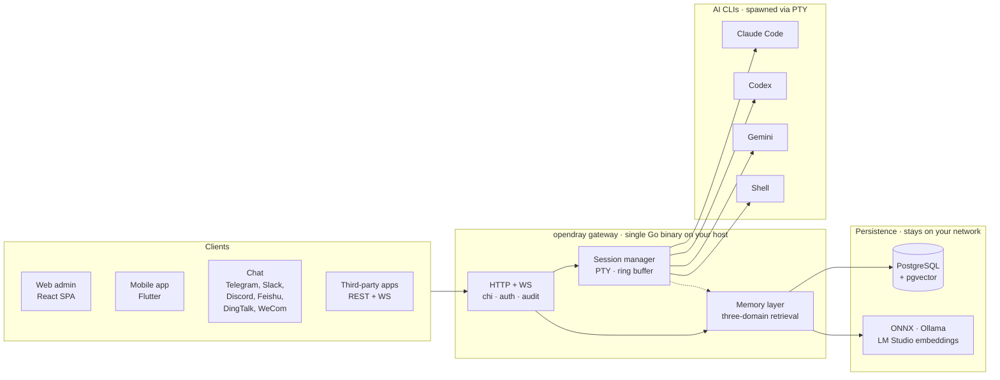

<p align="center">
  <a href="https://opendray.dev"></a>
</p>

<h1 align="center">opendray</h1>

<p align="center">
  <strong>Gateway autohospedado para Claude Code · Codex · Gemini · shell, con una capa de memoria local-first compartida entre todos ellos.</strong>
  <br/>
  <sub>Ejecuta sesiones en tu propia infraestructura. Contrólalo desde la web, el móvil o el chat. API abierta REST + WebSocket para integraciones.</sub>
</p>

<p align="center">
  <strong><a href="https://opendray.dev">🌐 opendray.dev</a></strong>
</p>

<p align="center">
  <a href="https://opendray.dev"></a>
  <a href="https://github.com/Opendray/opendray/releases/latest"></a>
  <a href="LICENSE"></a>
  <a href="https://github.com/Opendray/opendray/actions/workflows/ci.yml"></a>
  <a href="https://github.com/Opendray/opendray/discussions"></a>
  <br/>
  
  
  
  
</p>

<p align="center">
  🌐 <a href="README.md">English</a> · <a href="README.zh.md">简体中文</a> · <a href="README.fa.md">فارسی</a> · <strong>Español</strong> · <a href="README.pt-BR.md">Português</a> · <a href="README.ja.md">日本語</a> · <a href="README.ko.md">한국어</a> · <a href="README.fr.md">Français</a> · <a href="README.de.md">Deutsch</a> · <a href="README.ru.md">Русский</a>
</p>

---

## Por qué existe opendray

Tres fricciones del día a día con las CLIs de IA para programar que opendray viene a resolver.

**Las sesiones mueren cuando tu portátil se suspende.** Ejecutar Claude Code o Codex por SSH significa que el agente muere en el momento en que cierras la tapa o se cae el Wi-Fi. El contexto, las llamadas a herramientas en curso, el diff parcial que estabas a punto de revisar: todo se pierde. opendray ejecuta el agente en un host que no se suspende (un Mac mini debajo de tu escritorio, un NAS, un VPS) y te deja reconectarte desde un panel web, una app móvil en Flutter o un mensaje de chat. La sesión sigue ejecutándose esté quien esté conectado o no.

**Toparte con un rate limit no debería cargarse lo que estabas haciendo.** Si tienes varias cuentas de Anthropic (trabajo + personal, plan familiar + Pro), opendray las trata como un pool: te muestra el tier, la cuota y el número de sesiones activas por cuenta, reparte las nuevas sesiones entre ellas y te permite mover una sesión en vivo a otra cuenta sin perder la conversación. El transcript se va contigo. Mismo planteamiento para las cuentas de Codex y Gemini.

**La memoria es una capa de primera clase, no un parche.** La mayoría de las CLIs de IA reindexan el contexto del proyecto desde cero en cada sesión, quemando tokens en recuperaciones repetidas. opendray incluye un vector store local-first (embeddings con ONNX / Ollama / LM Studio) con recuperación en tres dominios (usuario, proyecto, sesión) más detección de drift entre capas. Cada byte se queda en tu red.

---

## ¿Qué es opendray?

**opendray** envuelve las CLIs de coding con IA que ya usas (Claude Code, Codex, Gemini y cualquier shell) y las convierte en algo que puedes controlar desde cualquier lugar. Ejecuta sesiones en tu servidor doméstico / NAS / VPS, recibe una notificación en Telegram cuando una queda inactiva y responde desde tu teléfono para alimentar el siguiente prompt, todo a través de un gateway autohospedado que controlas de extremo a extremo.

- 🛰 **Un backend, tres superficies.** Un único binario Go que sirve un panel web React y una app móvil Flutter, con cada acción también expuesta sobre una API REST + WebSocket para integraciones de terceros.
- 💬 **Seis canales bidireccionales, sin jardines amurallados.** Telegram, Slack, Discord, Feishu (飞书), DingTalk (钉钉), WeCom (企业微信), más un adaptador Bridge para cualquier cosa personalizada. Las respuestas en cualquier canal se enrutan de vuelta a la sesión correcta.
- 🧠 **Memoria local-first.** Embeddings con ONNX / Ollama / LM Studio, recuperación en tres ámbitos (usuario · proyecto · sesión), ranking inteligente y detección de conflictos entre capas. Los datos vectoriales no salen de tu red.
- 🔌 **API de nivel integración.** Claves de API con scope, audit log por cada llamada, montajes de reverse-proxy. Trata a opendray como el gateway detrás de tu propio producto, o simplemente como un centro de mando personal.
- 🔑 **Flota multi-cuenta de Claude.** Añade varias cuentas de `claude login` al gateway; el panel las detecta automáticamente con un filesystem watcher, balancea las sesiones nuevas entre cuentas activas, y permite cambiar una sesión en vivo de una cuenta a otra **sin perder la conversación** (la transcripción se migra por debajo). Cada fila de cuenta muestra capacidad en vivo (subscription tier, rate-limit tier, sesiones activas, último uso, email de Anthropic actual) para que elijas la correcta de un vistazo.
- 🔒 **Autohospedado, licencia clara.** Apache 2.0, un binario estático, releases firmados con cosign más SBOM SPDX. Sin telemetría, sin cuenta en la nube, sin suscripción.

## Arquitectura de un vistazo

Un único binario Go en tu host hace todo el trabajo. Los clientes manejan las sesiones por HTTP/WebSocket, el session manager lanza cada AI CLI en su propio PTY, y la capa de memory guarda el estado compartido en Postgres con vector embeddings desde tu propio provider.



Todo lo del diagrama corre en tu red. Sin dependencias cloud, sin inference fuera de tu control.

---

## Estado

**v2.7.0** (última). La generación v2 continúa iterando. Consulta
[`VERSIONING.md`](VERSIONING.md) para la política major-como-generación
(major = generación de producto, no "breaking change" estricto al estilo SemVer) y
[`CHANGELOG.md`](CHANGELOG.md) para el historial completo de releases.

Esta generación incluye:

- **Asistentes de instalación y desinstalación de una sola línea** (Linux + macOS;
  Windows se canaliza a través de WSL2). Guían al operador por bootstrap de Postgres,
  instalación de AI-CLIs, credenciales de admin, dirección de escucha, instalación del
  binario, migración del esquema y registro del servicio.
- **Binario autogestionado.** `opendray update / start / stop /
  restart / status / providers list / providers update`, para que los operadores
  no toquen `systemctl` / `launchctl` para tareas rutinarias.
- **Pipeline de release con Goreleaser.** Binarios compilados de forma cruzada
  (linux/darwin × amd64/arm64), firma keyless con cosign (Sigstore),
  SBOM SPDX, self-update verificado atómicamente.

## Instalación

### Instalador de una sola línea

**Linux / macOS / WSL2**

```sh
curl -fsSL https://raw.githubusercontent.com/Opendray/opendray/main/scripts/install.sh | bash
```

**Windows**: primero configura WSL2 y luego ejecuta el instalador de Linux dentro. [detalles →](scripts/README.md#windows)

```powershell
irm https://raw.githubusercontent.com/Opendray/opendray/main/scripts/install-windows.ps1 | iex
```

Recorre la configuración de Postgres, instalación de AI-CLIs, credenciales de admin y registro del servicio, dejando un gateway en marcha en ~5 a 10 minutos. Consulta [**`scripts/README.md`**](scripts/README.md) para saber qué hace el asistente, qué layout de archivos crea, sus opciones y troubleshooting.

> **¿Prefieres la guía manual?** Lee [**docs/getting-started.md**](docs/getting-started.md): una guía de 15 minutos de extremo a extremo que replica lo que hace el asistente para que verifiques cada paso tú mismo.

### npm / npx (Node ≥ 18)

Instala globalmente y añade `opendray` al `PATH`:

```sh
npm install -g opendray
```

O ejecútalo bajo demanda sin instalar:

```sh
npx opendray
```

Esto instala **solo el binario**: sin asistente, sin servicio, sin Postgres. El paquete trae el binario de plataforma correspondiente (`opendray-{linux,darwin}-{x64,arm64}`) vía `optionalDependencies` (el patrón de esbuild / Biome, sin `postinstall`, sin llamadas de red durante la instalación). Ideal para entornos con scripts, runners efímeros, o cuando ya ejecutas tu propio Postgres y supervisor de procesos.

Tú aportas la base de datos e inicias el gateway por tu cuenta:

```sh
# 1. PostgreSQL 15+ con pgvector: apunta un DSN a él y establece una contraseña de administración.
export OPENDRAY_DATABASE_URL="postgres://opendray:pw@127.0.0.1:5432/opendray?sslmode=disable"
export OPENDRAY_ADMIN_PASSWORD="$(openssl rand -base64 24)"
# 2. Aplica el esquema y luego ejecuta (primer plano).
opendray migrate
opendray serve        # → http://127.0.0.1:8770/admin/
```

Guía completa (configuración de pgvector, `config.toml`, ejecución como servicio systemd / launchd y actualización) en [**docs/install-binary.es.md**](docs/install-binary.es.md).

### Desinstalación (Linux / macOS)

**Por defecto:** detiene el gateway y elimina el binario, pero **conserva** tu `config.toml`, el directorio de datos (keyfile bcrypt, sesiones, notas, vault), los logs y la base de datos PostgreSQL para que una reinstalación retome donde lo dejaste:

```sh
curl -fsSL https://raw.githubusercontent.com/Opendray/opendray/main/scripts/uninstall.sh | bash
```

**Purga completa:** también elimina la base de datos + el role de PG, borra config / data / logs, y quita el service user. Incluye un paso de verificación post-borrado que falla ruidosamente si algo sobrevive:

```sh
curl -fsSL https://raw.githubusercontent.com/Opendray/opendray/main/scripts/uninstall.sh | OPENDRAY_PURGE=1 bash
```

### Comandos del día a día

Tras la instalación, el binario `opendray` gestiona su propio ciclo de vida, así que no necesitas recordar los rituales de `systemctl` / `launchctl`:

```sh
sudo opendray update --restart   # download latest release, verify SHA, atomic replace + restart
```

```sh
sudo opendray providers update   # bump installed AI CLIs (claude / codex / gemini) to npm-latest
```

```sh
opendray providers list          # see which AI CLIs are installed + their versions
```

```sh
sudo opendray start              # start | stop | restart | status, wraps systemd / launchd
```

`opendray --help` muestra el set completo de subcomandos.

### Selector de ruta de despliegue

Cada ruta soportada incluye spawn de sesiones, acceso a AI-CLI, backups cifrados y la API de integración completa. opendray es un gateway host-resident: lanza las AI CLIs vía PTYs y comparte estado de proceso (`~/.claude`, ssh-agent, archivos del proyecto) con ellas. Ese modelo es incompatible con el aislamiento de contenedores que Docker de producción impondría, por lo que Docker no es una ruta de despliegue soportada en v2.x.

| Ruta | Recomendada para | Ir a |
|---|---|---|
| 📦 **Binario pre-construido** | "Solo ejecútalo" en Linux / macOS, cualquier supervisor | [Página de releases](https://github.com/Opendray/opendray/releases) → ver [Despliegue de producción](#production-deploy) |
| 🐧 **Unidad systemd** | Linux bare-metal / VM / LXC | [Despliegue de producción §A](#option-a--systemd-bare-metal--vm--lxc) |
| 🍎 **LaunchDaemon de macOS** | Mac mini / Mac Studio como servidor doméstico | [Despliegue de producción §C](#option-c--macos-launchd-mac-mini--studio-as-home-server) |
| 🛠 **Build desde el código fuente** | Desarrollo / contribución / builds personalizados | [Quickstart](#quickstart-5-minute-dev-path) abajo |

<a id="quickstart-5-minute-dev-path"></a>

## Quickstart (ruta dev de 5 minutos)

Para una guía completa con prerrequisitos y troubleshooting, consulta [`docs/quickstart.md`](docs/quickstart.md). La ruta de desarrollo condensada:

```bash
# 1. Have a Postgres 15+ running on 127.0.0.1:5432 with pgvector enabled
#    (apt install postgresql-16 postgresql-16-pgvector / brew install postgresql@16 pgvector).
#    Point [database].url at any other DSN if you'd rather use a remote PG.

# 2. Local config (already gitignored).
cp config.example.toml config.toml
$EDITOR config.toml          # set [database].url, [admin].password

# 3. Build the web bundle into the embed tree.
cd app/web && pnpm install && pnpm build && cd ../..

# 4. Apply schema.
go run ./cmd/opendray migrate -config config.toml

# 5. Run.
go run ./cmd/opendray serve -config config.toml
# → REST + WS:  http://127.0.0.1:8770/api/v1/...
# → Web admin:  http://127.0.0.1:8770/admin/
```

Esto ejecuta OpenDray en primer plano; Ctrl-C lo detiene. Para un demonio de larga duración, consulta **Despliegue de producción** abajo.

<a id="production-deploy"></a>

## Despliegue de producción

Cuatro rutas de despliegue soportadas; elige la que encaje con tu entorno.
Cada una te da auto-restart en caso de crash, estado persistente y
separación de secretos respecto al config.

<a id="option-a--systemd-bare-metal--vm--lxc"></a>

### Opción A: systemd (bare-metal / VM / LXC)

La ruta de despliegue recomendada en Linux. Incluye una unit endurecida en
[`deploy/systemd/opendray.service`](deploy/systemd/opendray.service)
con sandboxing (`ProtectSystem=strict`, `NoNewPrivileges`,
`MemoryDenyWriteExecute`, capability scrub), arranque `migrate`-luego-`serve`,
y una ventana de parada elegante de 20 s.

**Consigue primero un binario.** O bien descarga un archivo pre-construido de la
[página de releases](https://github.com/Opendray/opendray/releases)
(`opendray_*_linux_<arch>.tar.gz`, que se descomprime en un único binario `opendray`),
o constrúyelo desde el código fuente vía el [Quickstart](#quickstart-5-minute-dev-path)
de arriba (`go build ./cmd/opendray`).

```bash
# 1. Install the binary you just grabbed (or built).
sudo install -m 0755 /path/to/opendray /usr/local/bin/opendray

# 2. Create the service user + state dir.
sudo useradd -r -s /usr/sbin/nologin -d /var/lib/opendray opendray
sudo install -d -o opendray -g opendray -m 0700 /var/lib/opendray

# 3. Drop config + secrets (root-owned; mode 0640).
sudo install -D -m 0640 config.example.toml /etc/opendray/config.toml
sudo $EDITOR /etc/opendray/config.toml             # set [database].url etc.
sudo install -D -m 0640 -o root -g opendray /dev/null /etc/opendray/env.d/secrets
sudo $EDITOR /etc/opendray/env.d/secrets           # OPENDRAY_ADMIN_PASSWORD=…

# 4. Install + enable the unit.
sudo cp deploy/systemd/opendray.service /etc/systemd/system/
sudo systemctl daemon-reload
sudo systemctl enable --now opendray

# 5. Verify.
sudo systemctl status opendray
sudo journalctl -u opendray -f --no-pager
```

La unit ejecuta `opendray migrate` como `ExecStartPre`, así que el primer arranque
aplica todas las migraciones antes de que `serve` comience. Los reinicios son
`on-failure` con back-off de 5 s y un límite de 5 ráfagas por minuto.

### Opción B: Binario directo + tu propio supervisor de procesos

Para LXC sin systemd, FreeBSD `rc.d`, OpenRC, o cualquier otra cosa.
Construye una vez, ejecuta con el supervisor que ya uses:

```bash
# Cross-compile a release archive locally:
goreleaser release --clean --snapshot
ls dist/                  # opendray_*_linux_amd64.tar.gz etc.

# Or grab a published release artefact:
# https://github.com/Opendray/opendray/releases
```

Luego apunta tu supervisor (s6, runit, supervisord, runwhen) a:

```
/usr/local/bin/opendray serve -config /etc/opendray/config.toml
```

Pre-flight: ejecuta `opendray migrate -config /etc/opendray/config.toml`
una vez antes del primer `serve`, o como hook pre-start en el supervisor
que prefieras.

<a id="option-c--macos-launchd-mac-mini--studio-as-home-server"></a>

### Opción C: launchd de macOS (Mac mini / Studio como servidor doméstico)

Para Mac mini / Mac Studio con Apple Silicon funcionando 24/7. Incluye un
LaunchDaemon en
[`deploy/launchd/com.opendray.opendray.plist`](deploy/launchd/com.opendray.opendray.plist)
que arranca al boot antes de cualquier login de usuario, reinicia ante un crash con
throttle de 5 s, y loguea a `/usr/local/var/log/opendray/`.

```bash
# 1. Install the darwin binary + config + state dirs.
sudo install -m 0755 ./opendray /usr/local/bin/opendray
sudo install -d -m 0755 \
  /usr/local/etc/opendray \
  /usr/local/var/lib/opendray \
  /usr/local/var/log/opendray
sudo install -m 0640 config.example.toml /usr/local/etc/opendray/config.toml
sudo $EDITOR /usr/local/etc/opendray/config.toml    # set [database].url etc.

# 2. Apply migrations once.
sudo /usr/local/bin/opendray migrate \
  -config /usr/local/etc/opendray/config.toml

# 3. Install + load the LaunchDaemon.
sudo cp deploy/launchd/com.opendray.opendray.plist /Library/LaunchDaemons/
sudo chown root:wheel /Library/LaunchDaemons/com.opendray.opendray.plist
sudo chmod 0644 /Library/LaunchDaemons/com.opendray.opendray.plist
sudo launchctl bootstrap system /Library/LaunchDaemons/com.opendray.opendray.plist

# 4. Verify.
sudo launchctl print system/com.opendray.opendray
tail -f /usr/local/var/log/opendray/opendray.log
```

Reinicia con `sudo launchctl kickstart -k system/com.opendray.opendray`;
descarga por completo con `sudo launchctl bootout system/com.opendray.opendray`.

Postgres en macOS: instálalo vía Homebrew (`brew install postgresql@17 && brew services start postgresql@17`) y apunta `[database].url` a
`postgres://$USER@127.0.0.1:5432/opendray`. Añade `pgvector` con
`brew install pgvector` y ejecuta `CREATE EXTENSION vector` dentro de la
base de datos opendray.

---

Para notas específicas de LXC en Proxmox (PTY en contenedores unprivileged,
networking, ajustes de cgroup), consulta [`deploy/lxc/proxmox-pty-notes.md`](deploy/lxc/proxmox-pty-notes.md).

Para reverse-proxy / terminación TLS (nginx, Caddy, Traefik, Cloudflare
Tunnel), consulta [`docs/operator-guide.md`](docs/operator-guide.md) §Topology.

### Opcional: habilitar backups cifrados de DB + exportaciones de datos

```bash
# Master passphrase (env-only, never write into config.toml).
export OPENDRAY_BACKUP_KEY="$(openssl rand -base64 32)"
export OPENDRAY_BACKUP_ENABLED=1

# pg_dump / pg_restore must match the server's major version. On
# Apple Silicon dev machines pointing at a PG17 server:
export OPENDRAY_BACKUP_PG_DUMP_PATH=/opt/homebrew/opt/postgresql@17/bin/pg_dump
export OPENDRAY_BACKUP_PG_RESTORE_PATH=/opt/homebrew/opt/postgresql@17/bin/pg_restore
```

Reinicia opendray; el sidebar muestra una página de Backups (`/backups`)
para volcados PostgreSQL cifrados + restore, y `/export` para
exportaciones de datos en bundle zip + import. Consulta [`docs/operator-guide.md`](docs/operator-guide.md) §Backup para el ciclo completo.

Un solo binario Go contiene todo el bundle web: sin runtime de Node en
runtime, sin servidor de archivos estáticos separado, sin Caddy/nginx
requeridos. Cloudflare Tunnel termina TLS delante de `:8770`.

## Layout

```
cmd/opendray/        binary entry point (≤100 LOC per design §14)
internal/
├── app/             composition root (wires every subsystem)
├── audit/           subscribes to bus topics, persists to audit_log
├── auth/            admin bearer tokens (M2.5)
├── backup/          encrypted DB dumps + admin export/import
├── catalog/         CLI provider manifests + per-id user config (M2)
├── channel/         channel hub + telegram impl (M4)
├── config/          TOML loader with OPENDRAY_* env overrides
├── eventbus/        in-process pub/sub
├── gateway/         chi HTTP router + middleware + slog
├── integration/     external-app registry + reverse proxy + events WS (M3)
├── memory/          cross-CLI persistent memory
├── session/         PTY lifecycle + ring buffer + WS stream (M1)
├── store/           pgx pool + hand-rolled migration runner (M0)
├── version/         build-time identification
└── web/             go:embed of the web bundle (W5)

app/web/             React 19 + TypeScript + Vite SPA (Phase 2 W0-W5)
app/mobile/          Flutter app (iOS + Android), feature parity with web
docs/
├── design.md        SSOT north-star
└── adr/             architecture decisions, dated
```

## Frontend web

`app/web/` construye una SPA única en `internal/web/dist/`, que el binario Go
empotra y sirve en `/admin/*`. El dev server de Vite en `:5173` hace proxy de
`/api` hacia `:8770` para desarrollo con HMR.

```bash
# dev (hot reload on the React side, separate Go server for the API)
cd app/web && pnpm dev               # http://localhost:5173
go run ./cmd/opendray serve -config ../../config.toml   # other terminal

# prod (one binary delivers everything)
cd app/web && pnpm build              # writes ../../internal/web/dist
cd ../..
go build ./cmd/opendray               # bakes dist into the binary
./opendray serve -config config.toml
```

Consulta [`app/web/README.md`](app/web/README.md) para el stack de frontend
(React + Vite + Tailwind v4 + shadcn/ui + TanStack Router/Query +
Zustand + xterm.js) y notas por milestone W.

## Documentación

- [`docs/getting-started.md`](docs/getting-started.md): **empieza aquí** si eres nuevo. De cero a tu primera sesión en 15 minutos, incluyendo la instalación de las CLIs envueltas y el bootstrap de Postgres
- [`docs/install-binary.es.md`](docs/install-binary.es.md): instala desde el paquete npm o un binario de release (aporta tu propio Postgres) y ejecútalo como servicio systemd / launchd
- [`docs/quickstart.md`](docs/quickstart.md): entorno de desarrollo de 5 minutos (asume que ya conoces las piezas en movimiento)
- [`docs/mobile-app.es.md`](docs/mobile-app.es.md): compila e instala la app móvil de Flutter — sideload de un APK de Android o instalación en iPhone vía Xcode, y luego apúntala a tu gateway
- [`docs/operator-guide.md`](docs/operator-guide.md): referencia de despliegue + ops para setups de producción
- [`docs/integration-guide.md`](docs/integration-guide.md): cómo escribir una integración externa en cualquier lenguaje
- [`VERSIONING.md`](VERSIONING.md): estrategia de versionado (major-as-generation)
- [`CHANGELOG.md`](CHANGELOG.md): historial de releases

## Tests

```bash
go test -race ./...        # backend
cd app/web && pnpm build   # web (TS strict + vite production build)
```

Los smoke flows end-to-end se trackean en los commit messages por milestone.
Un harness Playwright está planificado como follow-up.

## Relación con v1

v1 (`Opendray/opendray`) es el codebase legacy, ahora archivado. v2 es
la generación actual y activa: feature-complete y la única rama que
recibe desarrollo. De los 16 builtins de v1, cuatro migraron al backend
de v2; el resto se convirtió en features del lado del cliente, adaptadores
de canal, o consumidores de la API de integración.

## Licencia

Apache 2.0; consulta [`LICENSE`](LICENSE). (v1 era MIT; v2 está
licenciada de forma independiente.)
