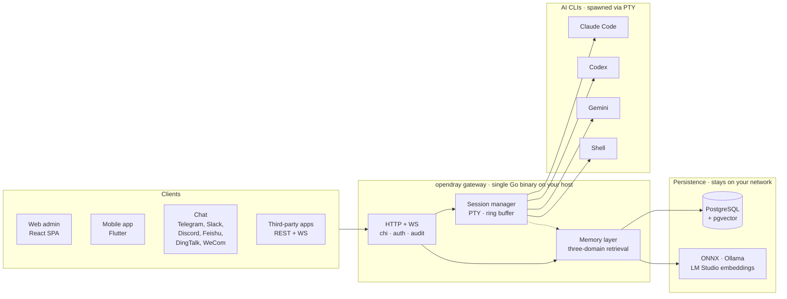

# opendray

<p dir="rtl" align="right">
یک gateway خودمیزبان برای اجرای Claude Code، Codex، Gemini و shell؛ همراه با یک لایه memory مشترک و local-first بین همه آن‌ها.
</p>

<p dir="rtl" align="right">
سشن‌های کاری را روی زیرساخت خودتان اجرا کنید، از طریق web، mobile یا chat کنترلشان کنید، و برای integrationهای دیگر هم یک REST + WebSocket API باز داشته باشید.
</p>

<p align="right">
<a href="https://opendray.dev">opendray.dev</a>
</p>

<p dir="rtl" align="right">
<a href="README.md">English</a> · <a href="README.zh.md">简体中文</a> · فارسی · <a href="README.es.md">Español</a> · <a href="README.pt-BR.md">Português</a> · <a href="README.ja.md">日本語</a> · <a href="README.ko.md">한국어</a> · <a href="README.fr.md">Français</a> · <a href="README.de.md">Deutsch</a> · <a href="README.ru.md">Русский</a>
</p>

---

<h2 dir="rtl" align="right">چرا opendray وجود دارد؟</h2>

<p dir="rtl" align="right">
این پروژه برای برطرف کردن چند مشکل جدی و تکراری در کار روزمره با AI coding CLIها ساخته شده است.
</p>

<h3 dir="rtl" align="right">وقتی laptop sleep می‌شود، session نباید از بین برود</h3>

<p dir="rtl" align="right">
اگر Claude Code یا Codex را از طریق SSH روی laptop اجرا کنید، به‌محض این‌که درِ دستگاه را ببندید یا Wi‑Fi قطع شود، agent هم عملاً از بین می‌رود. context، tool callهای در حال اجرا، diff نیمه‌کاره‌ای که قرار بوده review کنید، و هر چیزی که وسط کار بوده ممکن است از دست برود.
</p>

<p dir="rtl" align="right">
opendray agent را روی hostای اجرا می‌کند که قرار نیست sleep شود؛ مثلاً یک Mac mini زیر میز، یک NAS یا یک VPS. بعد می‌توانید از web panel، mobile app مبتنی بر Flutter یا حتی از طریق chat دوباره به همان session وصل شوید. session به کارش ادامه می‌دهد؛ چه online باشید، چه نباشید.
</p>

<h3 dir="rtl" align="right">rate limit نباید کارتان را خراب کند</h3>

<p dir="rtl" align="right">
اگر چند Anthropic account دارید، مثلاً work account و personal account یا Pro و Family، opendray آن‌ها را مثل یک capacity pool مدیریت می‌کند. status مربوط به quota، tier و تعداد active sessionهای هر account را نشان می‌دهد، sessionهای جدید را بین accountهای فعال balance می‌کند، و حتی اجازه می‌دهد یک live session را بدون از دست دادن conversation به account دیگری منتقل کنید. transcript همراه session جابه‌جا می‌شود. همین مدل برای Codex و Gemini accountها هم در نظر گرفته شده است.
</p>

<h3 dir="rtl" align="right">memory باید جزء اصلی سیستم باشد، نه یک قابلیت اضافه‌شده در آخر</h3>

<p dir="rtl" align="right">
بیشتر AI CLIها در هر session دوباره project context را از صفر index می‌کنند و tokenها را صرف retrievalهای تکراری می‌کنند. opendray یک local-first vector store ارائه می‌دهد که با ONNX، Ollama و LM Studio embeddings کار می‌کند و retrieval را در سه scope انجام می‌دهد: user، project و session. همچنین drift و ناسازگاری بین memory layerها را تشخیص می‌دهد. داده‌ها روی network و infrastructure خودتان باقی می‌مانند.
</p>

---

<h2 dir="rtl" align="right">OpenDray چیست؟</h2>

<p dir="rtl" align="right">
OpenDray ابزارهای AI CLI شما، مثل Claude Code، Codex، Gemini و هر shell دیگری را به یک platform واحد تبدیل می‌کند؛ platformای که از هرجا قابل دسترسی است و کنترلش دست خودتان می‌ماند.
</p>

<p dir="rtl" align="right">
می‌توانید working sessionها را روی home server، NAS یا VPS اجرا کنید، وقتی idle می‌شوند یا نیاز به input دارند در Telegram notification بگیرید، و فقط با reply کردن از روی گوشی، prompt بعدی را برای ادامه کار ارسال کنید.
</p>

<p dir="rtl" align="right">
همه این قابلیت‌ها از طریق یک self-hosted gateway ارائه می‌شود؛ بدون وابستگی به سرویس واسط، بدون lock-in، و با مالکیت کامل روی data و communication.
</p>

<ul dir="rtl" align="right">
<li><strong>یک backend، چند interface:</strong> یک Go binary واحد که React web admin و Flutter mobile app را سرویس می‌دهد. تمام operationها از طریق REST و WebSocket API هم برای third-party integrationها قابل استفاده است.</li>
<li><strong>کانال‌های دوطرفه، بدون lock-in:</strong> Telegram، Slack، Discord، Feishu، DingTalk، WeCom و یک bridge adapter برای اتصال‌های custom. replyهایی که در هر channel می‌فرستید به session درست برمی‌گردند.</li>
<li><strong>local-first memory:</strong> استفاده از ONNX، Ollama و LM Studio embeddings، retrieval در سطح user/project/session، smart ranking برای resultها، و تشخیص conflict بین memory layerها. vector data روی network خودتان می‌ماند و به بیرون ارسال نمی‌شود.</li>
<li><strong>API مناسب integration:</strong> scoped API key، audit log برای هر call و reverse-proxy mountها. می‌توانید opendray را به‌عنوان gateway پشت محصول خودتان استفاده کنید یا فقط آن را command centre شخصی خودتان بدانید.</li>
<li><strong>multi-account management برای Claude:</strong> چند <code>claude login</code> را داخل gateway قرار دهید. panel با filesystem watcher خودش آن‌ها را پیدا می‌کند، sessionهای جدید را بین accountهای فعال balance می‌کند، و اجازه می‌دهد یک live session را <strong>بدون از دست دادن conversation</strong> بین accountها جابه‌جا کنید. transcript در پشت صحنه منتقل می‌شود.</li>
<li><strong>ظرفیت accountها در یک نگاه:</strong> هر ردیف، وضعیت account را live نشان می‌دهد؛ از جمله <code>subscription tier</code>، <code>rate-limit tier</code>، <code>active sessions</code>، <code>last-used</code> و <code>current Anthropic email</code> تا سریع‌تر account درست را انتخاب کنید.</li>
<li><strong>self-hosted با license شفاف:</strong> Apache 2.0، یک static binary، releaseهای امضاشده با cosign و SPDX SBOM. بدون telemetry، بدون cloud account و بدون subscription.</li>
</ul>

---

<h2 dir="rtl" align="right">architecture در یک نگاه</h2>

<p dir="rtl" align="right">
یک Go binary روی host شما همه‌چیز را اداره می‌کند. clientها از طریق HTTP/WebSocket، sessionها را راه می‌اندازند، session manager هر AI CLI را در یک PTY مستقل spawn می‌کند، و memory layer شامل shared state در Postgres با vector embeddingsای است که از provider خودتان می‌آید.
</p>



<p dir="rtl" align="right">
هرچه در دیاگرام می‌بینید روی network خودتان اجرا می‌شود. بدون وابستگی به cloud، بدون inference بیرون از کنترل شما.
</p>

---

<h2 dir="rtl" align="right">وضعیت نسخه</h2>

<p dir="rtl" align="right">
نسخه ۲٫۷٫۱ آخرین release فعلی است و development روی v2 همچنان ادامه دارد.
</p>

<p dir="rtl" align="right">
برای policy مربوط به major-as-generation، فایل <a href="VERSIONING.md"><code>VERSIONING.md</code></a> را ببینید. در این پروژه، major الزاماً به معنی breaking change به معنای سخت‌گیرانه SemVer نیست؛ بیشتر به نسل محصول اشاره دارد. برای تاریخچه کامل releaseها هم <a href="CHANGELOG.md"><code>CHANGELOG.md</code></a> را بخوانید.
</p>

<p dir="rtl" align="right">
این generation شامل موارد زیر است:
</p>

<ul dir="rtl" align="right">
<li><strong>one-line install و uninstall wizard</strong> برای Linux و macOS. مسیر Windows از طریق WSL2 انجام می‌شود. wizard، operator را مرحله‌به‌مرحله از Postgres setup، نصب AI CLIها، تنظیم admin credentialها، تعیین listen address، نصب binary، اجرای schema migration و ثبت service عبور می‌دهد.</li>
<li><strong>self-managing binary:</strong> با دستورهای <code>opendray update / start / stop / restart / status / providers list / providers update</code> برای کارهای روزمره لازم نیست مستقیم سراغ <code>systemctl</code> یا <code>launchctl</code> بروید.</li>
<li><strong>release pipeline با Goreleaser:</strong> شامل cross-compiled binaryها برای <code>linux/darwin × amd64/arm64</code>، keyless signing با cosign و Sigstore، SPDX SBOM و atomic verified self-update.</li>
</ul>

---

<h2 dir="rtl" align="right">نصب</h2>

<h3 dir="rtl" align="right">one-line installer</h3>

<p dir="rtl" align="right">
<strong>Linux / macOS / WSL2</strong>
</p>

```sh
curl -fsSL https://raw.githubusercontent.com/Opendray/opendray/main/scripts/install.sh | bash
```

<p dir="rtl" align="right">
<strong>Windows:</strong> ابتدا WSL2 را راه‌اندازی می‌کند و سپس Linux installer را داخل آن اجرا می‌کند. <a href="scripts/README.md#windows">جزئیات →</a>
</p>

```powershell
irm https://raw.githubusercontent.com/Opendray/opendray/main/scripts/install-windows.ps1 | iex
```

<p dir="rtl" align="right">
این مسیر Postgres setup، نصب AI CLIها، admin credentialها و service registration را انجام می‌دهد و معمولاً بعد از حدود ۵ تا ۱۰ دقیقه یک gateway آماده تحویل می‌دهد. اگر می‌خواهید دقیقاً بدانید wizard چه کاری انجام می‌دهد، چه layoutای می‌سازد، چه optionهایی دارد و چطور باید debug کنید، به <a href="scripts/README.md"><strong><code>scripts/README.md</code></strong></a> سر بزنید.
</p>

<blockquote dir="rtl">
<p align="right">
<strong>راهنمای دستی و قدم‌به‌قدم می‌خواهید؟</strong><br>
<a href="docs/getting-started.md"><code>docs/getting-started.md</code></a> را بخوانید. این راهنما همان مسیر wizard را در قالب یک walkthrough حدوداً ۱۵ دقیقه‌ای باز می‌کند تا بتوانید هر مرحله را خودتان بررسی کنید.
</p>
</blockquote>

---

<h3 dir="rtl" align="right">npm / npx</h3>

<p dir="rtl" align="right">
نیازمند Node نسخه ۱۸ یا بالاتر.
</p>

<p dir="rtl" align="right">
نصب global و اضافه شدن <code>opendray</code> به <code>PATH</code>:
</p>

```sh
npm install -g opendray
```

<p dir="rtl" align="right">
یا اجرای on-demand بدون نصب دائمی:
</p>

```sh
npx opendray
```

<p dir="rtl" align="right">
این روش فقط <strong>binary</strong> را نصب می‌کند؛ نه wizard، نه service و نه Postgres.
</p>

<p dir="rtl" align="right">
binary package مناسب platform شما، مثل <code>opendray-{linux,darwin}-{x64,arm64}</code> از طریق <code>optionalDependencies</code> دریافت می‌شود. این مدل شبیه esbuild و Biome است: بدون <code>postinstall</code> و بدون network call هنگام نصب. این روش برای scripted environmentها، ephemeral runnerها یا زمانی مناسب است که Postgres و process supervisor خودتان را از قبل دارید.
</p>

<p dir="rtl" align="right">
در این حالت، database و gateway را خودتان آماده و اجرا می‌کنید:
</p>

```sh
# 1. PostgreSQL 15+ with pgvector
# یک DSN تعریف کنید و برای admin هم password بگذارید.

export OPENDRAY_DATABASE_URL="postgres://opendray:pw@127.0.0.1:5432/opendray?sslmode=disable"
export OPENDRAY_ADMIN_PASSWORD="$(openssl rand -base64 24)"

# 2. schema را اعمال کنید و بعد gateway را در foreground اجرا کنید.

opendray migrate
opendray serve        # → http://127.0.0.1:8770/admin/
```

<p dir="rtl" align="right">
راهنمای کامل راه‌اندازی pgvector، تنظیم <code>config.toml</code>، اجرای systemd یا launchd service و update در <a href="docs/install-binary.fa.md"><code>docs/install-binary.fa.md</code></a> آمده است.
</p>

---

<h2 dir="rtl" align="right">حذف نصب در Linux و macOS</h2>

<h3 dir="rtl" align="right">حذف پیش‌فرض</h3>

<p dir="rtl" align="right">
gateway را stop می‌کند و binary را حذف می‌کند، اما <code>config.toml</code>، مسیر data مثل bcrypt keyfile، sessionها، noteها و vault، logها و PostgreSQL database را نگه می‌دارد تا اگر دوباره نصب کردید، از همان‌جا ادامه دهید.
</p>

```sh
curl -fsSL https://raw.githubusercontent.com/Opendray/opendray/main/scripts/uninstall.sh | bash
```

<h3 dir="rtl" align="right">حذف کامل</h3>

<p dir="rtl" align="right">
علاوه بر موارد بالا، PostgreSQL database و role مربوطه، config، data، logها و service user را هم حذف می‌کند. بعد از حذف هم یک verification step اجرا می‌شود تا اگر چیزی باقی مانده بود، بی‌سروصدا نادیده گرفته نشود.
</p>

```sh
curl -fsSL https://raw.githubusercontent.com/Opendray/opendray/main/scripts/uninstall.sh | OPENDRAY_PURGE=1 bash
```

---

<h2 dir="rtl" align="right">دستورات روزمره</h2>

<p dir="rtl" align="right">
بعد از نصب، خود binary <code>opendray</code> lifecycle سرویس را مدیریت می‌کند. لازم نیست دستورهای طولانی <code>systemctl</code> یا <code>launchctl</code> را حفظ کنید.
</p>

```sh
sudo opendray update --restart   # download latest release, verify SHA, atomic replace + restart
sudo opendray providers update   # bump installed AI CLIs: claude / codex / gemini
opendray providers list          # see installed AI CLIs and their versions
sudo opendray start              # start | stop | restart | status via systemd / launchd
opendray --help                  # show all subcommands
```

---

<h2 dir="rtl" align="right">انتخاب روش راه‌اندازی</h2>

<p dir="rtl" align="right">
همه مسیرهای پشتیبانی‌شده امکان spawn کردن session، دسترسی به AI CLIها، encrypted backup و integration API کامل را دارند.
</p>

<p dir="rtl" align="right">
opendray یک host-resident gateway است. AI CLIها را از طریق PTY اجرا می‌کند و process state مثل <code>~/.claude</code>، <code>ssh-agent</code> و project fileها را با آن‌ها share می‌کند. این مدل با container isolationای که production Docker تحمیل می‌کند خوب جور درنمی‌آید؛ بنابراین Docker در v2.x مسیر پشتیبانی‌شده محسوب نمی‌شود.
</p>

| Path | Best for | Next |
|---|---|---|
| **ready-made binary** | Run-only setup on Linux/macOS with your own process manager | [release page](https://github.com/Opendray/opendray/releases), then [production deployment](#انتشار-عملیاتی) |
| **systemd unit** | bare-metal, VM, or Linux LXC | [Option 1: systemd](#گزینه-۱-systemd-برای-bare-metal--vm--lxc) |
| **macOS LaunchDaemon** | Mac mini or Mac Studio used as a home server | [Option 3: macOS launchd](#گزینه-۳-macos-launchd-برای-mac-mini--mac-studio-بهعنوان-home-server) |
| **build from source** | development, contribution, or custom builds | [Quickstart](#quickstart-مسیر-۵-دقیقهای-برای-dev) |

---

<h2 dir="rtl" align="right">Quickstart: مسیر ۵ دقیقه‌ای برای dev</h2>

<p dir="rtl" align="right">
برای راهنمای کامل، همراه با prerequisiteها و troubleshooting، فایل <a href="docs/quickstart.md"><code>docs/quickstart.md</code></a> را ببینید.
</p>

<p dir="rtl" align="right">
مسیر خلاصه development:
</p>

```bash
# 1. Have a Postgres 15+ running on 127.0.0.1:5432 with pgvector enabled.
#    Example:
#    apt install postgresql-16 postgresql-16-pgvector
#    or:
#    brew install postgresql@16 pgvector
#
#    اگر remote PG را ترجیح می‌دهید،
#    [database].url را به DSN همان database اشاره دهید.

# 2. Local config. این فایل از قبل gitignored است.

cp config.example.toml config.toml
$EDITOR config.toml          # set [database].url, [admin].password

# 3. Build the web bundle into the embed tree.

cd app/web && pnpm install && pnpm build && cd ../..

# 4. Apply schema.

go run ./cmd/opendray migrate -config config.toml

# 5. Run.

go run ./cmd/opendray serve -config config.toml

# → REST + WS:  http://127.0.0.1:8770/api/v1/...
# → Web admin:  http://127.0.0.1:8770/admin/
```

<p dir="rtl" align="right">
این روش opendray را در foreground اجرا می‌کند و با <code>Ctrl-C</code> متوقف می‌شود. اگر daemonای می‌خواهید که برای مدت طولانی بالا بماند، بخش <strong>انتشار عملیاتی</strong> را ببینید.
</p>

---

<h2 dir="rtl" align="right">انتشار عملیاتی</h2>

<p dir="rtl" align="right">
چهار مسیر deployment پشتیبانی‌شده داریم؛ هرکدام که به environment شما می‌خورد همان را انتخاب کنید. همه آن‌ها auto-restart هنگام crash، state پایدار، و جداسازی secrets از config را فراهم می‌کنند.
</p>

<h3 dir="rtl" align="right">گزینه ۱: systemd برای bare-metal / VM / LXC</h3>

<p dir="rtl" align="right">
این مسیر، روش پیشنهادی برای Linux deployment است.
</p>

<p dir="rtl" align="right">
یک hardened unit در <a href="deploy/systemd/opendray.service"><code>deploy/systemd/opendray.service</code></a> ارائه می‌شود که شامل sandboxing مثل <code>ProtectSystem=strict</code>، <code>NoNewPrivileges</code>، <code>MemoryDenyWriteExecute</code> و capability scrub است. boot flow آن <code>migrate</code> سپس <code>serve</code> است و یک graceful stop window بیست‌ثانیه‌ای دارد.
</p>

<p dir="rtl" align="right">
<strong>اول binary را بگیرید.</strong> یا یک archive آماده را از <a href="https://github.com/Opendray/opendray/releases">release page</a> بردارید، مثل <code>opendray_*_linux_.tar.gz</code> که به یک single <code>opendray</code> binary unpack می‌شود، یا از طریق <a href="#quickstart-مسیر-۵-دقیقهای-برای-dev">Quickstart</a> از source build بگیرید: <code>go build ./cmd/opendray</code>.
</p>

```bash
# 1. Install the binary you just grabbed or built.

sudo install -m 0755 /path/to/opendray /usr/local/bin/opendray

# 2. Create the service user and state dir.

sudo useradd -r -s /usr/sbin/nologin -d /var/lib/opendray opendray
sudo install -d -o opendray -g opendray -m 0700 /var/lib/opendray

# 3. Drop config and secrets. root-owned; mode 0640.

sudo install -D -m 0640 config.example.toml /etc/opendray/config.toml
sudo $EDITOR /etc/opendray/config.toml     # set [database].url etc.

sudo install -D -m 0640 -o root -g opendray /dev/null /etc/opendray/env.d/secrets
sudo $EDITOR /etc/opendray/env.d/secrets   # OPENDRAY_ADMIN_PASSWORD=...

# 4. Install and enable the unit.

sudo cp deploy/systemd/opendray.service /etc/systemd/system/
sudo systemctl daemon-reload
sudo systemctl enable --now opendray

# 5. Verify.

sudo systemctl status opendray
sudo journalctl -u opendray -f --no-pager
```

<p dir="rtl" align="right">
این unit، دستور <code>opendray migrate</code> را به‌عنوان <code>ExecStartPre</code> اجرا می‌کند؛ بنابراین در اولین boot، همه migrationها قبل از شروع <code>serve</code> اعمال می‌شوند. restartها هم <code>on-failure</code> هستند، با back-off پنج‌ثانیه‌ای و limit پنج‌بار در دقیقه.
</p>

---

<h3 dir="rtl" align="right">گزینه ۲: direct binary + process manager دلخواه</h3>

<p dir="rtl" align="right">
برای LXC بدون systemd، FreeBSD <code>rc.d</code>، OpenRC یا هر process manager دیگری.
</p>

<p dir="rtl" align="right">
یک بار build بگیرید و با process managerی که از قبل دارید اجرا کنید:
</p>

```bash
# Cross-compile a release archive locally:

goreleaser release --clean --snapshot
ls dist/        # opendray_*_linux_amd64.tar.gz etc.

# Or grab a published release artefact:
# https://github.com/Opendray/opendray/releases
```

<p dir="rtl" align="right">
بعد process manager خودتان مثل s6، runit، supervisord یا runwhen را به این command اشاره دهید:
</p>

```sh
/usr/local/bin/opendray serve -config /etc/opendray/config.toml
```

<p dir="rtl" align="right">
قبل از اولین <code>serve</code>، یک بار این command را اجرا کنید:
</p>

```sh
opendray migrate -config /etc/opendray/config.toml
```

<p dir="rtl" align="right">
یا آن را به‌عنوان pre-start hook در process manager دلخواهتان قرار دهید.
</p>

---

<h3 dir="rtl" align="right">گزینه ۳: macOS launchd برای Mac mini / Mac Studio به‌عنوان home server</h3>

<p dir="rtl" align="right">
برای Apple Silicon Mac mini یا Mac Studio که ۲۴/۷ روشن است.
</p>

<p dir="rtl" align="right">
یک LaunchDaemon در <a href="deploy/launchd/com.opendray.opendray.plist"><code>deploy/launchd/com.opendray.opendray.plist</code></a> ارائه می‌شود که هنگام boot و قبل از user login بالا می‌آید، در صورت crash با throttle پنج‌ثانیه‌ای دوباره start می‌شود، و در <code>/usr/local/var/log/opendray/</code> log می‌نویسد.
</p>

```bash
# 1. Install the darwin binary, config and state dirs.

sudo install -m 0755 ./opendray /usr/local/bin/opendray
sudo install -d -m 0755 \
  /usr/local/etc/opendray \
  /usr/local/var/lib/opendray \
  /usr/local/var/log/opendray

sudo install -m 0640 config.example.toml /usr/local/etc/opendray/config.toml
sudo $EDITOR /usr/local/etc/opendray/config.toml   # set [database].url etc.

# 2. Apply migrations once.

sudo /usr/local/bin/opendray migrate \
  -config /usr/local/etc/opendray/config.toml

# 3. Install and load the LaunchDaemon.

sudo cp deploy/launchd/com.opendray.opendray.plist /Library/LaunchDaemons/
sudo chown root:wheel /Library/LaunchDaemons/com.opendray.opendray.plist
sudo chmod 0644 /Library/LaunchDaemons/com.opendray.opendray.plist
sudo launchctl bootstrap system /Library/LaunchDaemons/com.opendray.opendray.plist

# 4. Verify.

sudo launchctl print system/com.opendray.opendray
tail -f /usr/local/var/log/opendray/opendray.log
```

```sh
# Restart
sudo launchctl kickstart -k system/com.opendray.opendray

# Full unload
sudo launchctl bootout system/com.opendray.opendray
```

```sh
# PostgreSQL on macOS
brew install postgresql@17 && brew services start postgresql@17

# pgvector
brew install pgvector
```

```text
postgres://$USER@127.0.0.1:5432/opendray
```

```sql
CREATE EXTENSION vector;
```

<p dir="rtl" align="right">
برای noteهای مخصوص Proxmox LXC، مثل PTY داخل unprivileged containerها، networking و cgroup settingها، به <a href="deploy/lxc/proxmox-pty-notes.md"><code>deploy/lxc/proxmox-pty-notes.md</code></a> نگاه کنید.
</p>

<p dir="rtl" align="right">
برای reverse-proxy و TLS termination، مثل nginx، Caddy، Traefik و Cloudflare Tunnel، بخش Topology در <a href="docs/operator-guide.md"><code>docs/operator-guide.md</code></a> را ببینید.
</p>

---

<h2 dir="rtl" align="right">اختیاری: فعال‌سازی encrypted DB backup و data export</h2>

```bash
# Master passphrase. env-only: never write it into config.toml.

export OPENDRAY_BACKUP_KEY="$(openssl rand -base64 32)"
export OPENDRAY_BACKUP_ENABLED=1

# pg_dump / pg_restore must match the server's major version.
# Example for Apple Silicon dev machines pointing at a PG17 server:

export OPENDRAY_BACKUP_PG_DUMP_PATH=/opt/homebrew/opt/postgresql@17/bin/pg_dump
export OPENDRAY_BACKUP_PG_RESTORE_PATH=/opt/homebrew/opt/postgresql@17/bin/pg_restore
```

<p dir="rtl" align="right">
opendray را restart کنید. sidebar یک صفحه Backups در مسیر <code>/backups</code> برای encrypted PostgreSQL dump و restore اضافه می‌کند. مسیر <code>/export</code> هم برای zip-bundle data export و import استفاده می‌شود. برای چرخه کامل، بخش Backup در <a href="docs/operator-guide.md"><code>docs/operator-guide.md</code></a> را ببینید.
</p>

<p dir="rtl" align="right">
کل web UI داخل یک Go binary قرار گرفته است؛ بنابراین در runtime نیازی به Node.js، static file server جداگانه یا ابزارهایی مثل Caddy و Nginx ندارید. البته Cloudflare Tunnel همچنان می‌تواند TLS را قبل از رسیدن traffic به پورت <code>8770</code> terminate کند.
</p>

---

<h2 dir="rtl" align="right">ساختار پروژه</h2>

```text
cmd/opendray/
  entrypoint اصلی binary

internal/
├── app/           bootstrap و اتصال componentهای اصلی برنامه
├── audit/         دریافت eventها از bus و ذخیره در audit_log
├── auth/          admin Bearer tokenها
├── backup/        encrypted DB backup و data import/export
├── catalog/       provider manifestها و per-user config
├── channel/       channel management و Telegram integration
├── config/        load کردن TOML config و OPENDRAY_* environment variables
├── eventbus/      internal Pub/Sub
├── gateway/       HTTP routing با chi، middleware و slog
├── integration/   external app registration، Reverse Proxy و WebSocket eventها
├── memory/        shared persistent memory بین CLIها
├── session/       session management، PTY، ring buffer و WebSocket stream
├── store/         PostgreSQL connection با pgx و migrationها
├── version/       version و build metadata
└── web/           embedded web UI با go:embed

app/web/
  React 19 + TypeScript + Vite single-page app

app/mobile/
  Flutter app برای Android و iOS با featureهای مشابه web version

docs/
├── design.md      سند اصلی طراحی و مرجع پروژه
└── adr/           Architecture Decision Recordها
```

---

<h2 dir="rtl" align="right">web frontend</h2>

<p dir="rtl" align="right">
<code>app/web/</code> یک SPA واحد را در <code>internal/web/dist/</code> build می‌کند. Go binary آن را embed می‌کند و از مسیر <code>/admin/*</code> سرو می‌کند. Vite dev server روی <code>:5173</code> مسیر <code>/api</code> را به <code>:8770</code> proxy می‌کند تا development با HMR انجام شود.
</p>

```bash
# dev: hot reload on React side, separate Go server for API

cd app/web && pnpm dev       # http://localhost:5173

go run ./cmd/opendray serve -config ../../config.toml   # other terminal

# prod: one binary delivers everything

cd app/web && pnpm build     # writes ../../internal/web/dist
cd ../..
go build ./cmd/opendray      # bakes dist into the binary
./opendray serve -config config.toml
```

<p dir="rtl" align="right">
برای frontend stack، یعنی <code>React</code> + <code>Vite</code> + <code>Tailwind v4</code> + <code>shadcn/ui</code> + <code>TanStack Router/Query</code> + <code>Zustand</code> + <code>xterm.js</code>، و noteهای مربوط به milestoneهای W، به <a href="app/web/README.md"><code>app/web/README.md</code></a> نگاه کنید.
</p>

---

<h2 dir="rtl" align="right">مستندات</h2>

<ul dir="rtl" align="right">
<li><a href="docs/getting-started.md"><code>docs/getting-started.md</code></a>: اگر تازه شروع کرده‌اید، از اینجا شروع کنید؛ از صفر تا اولین session در حدود ۱۵ دقیقه، شامل نصب CLIهای موردنیاز و bootstrap کردن Postgres.</li>
<li><a href="docs/install-binary.fa.md"><code>docs/install-binary.fa.md</code></a>: نصب از npm package یا release binary، با فرض این‌که Postgres را خودتان آماده می‌کنید، و اجرا به‌عنوان systemd یا launchd service.</li>
<li><a href="docs/quickstart.md"><code>docs/quickstart.md</code></a>: مسیر پنج‌دقیقه‌ای برای dev environment؛ مناسب وقتی که moving partها را از قبل می‌شناسید.</li>
<li><a href="docs/mobile-app.fa.md"><code>docs/mobile-app.fa.md</code></a>: ساخت و نصب اپ موبایل Flutter — یک Android APK را sideload کنید یا با Xcode روی iPhone نصب کنید، و بعد آن را به gateway خودتان وصل کنید.</li>
<li><a href="docs/operator-guide.md"><code>docs/operator-guide.md</code></a>: مرجع deploy و ops برای production-like setupها.</li>
<li><a href="docs/integration-guide.md"><code>docs/integration-guide.md</code></a>: راهنمای نوشتن external integration با هر زبان برنامه‌نویسی.</li>
<li><a href="VERSIONING.md"><code>VERSIONING.md</code></a>: استراتژی versioning مبتنی بر major-as-generation.</li>
<li><a href="CHANGELOG.md"><code>CHANGELOG.md</code></a>: تاریخچه releaseها.</li>
</ul>

---

<h2 dir="rtl" align="right">تست‌ها</h2>

```bash
go test -race ./...          # backend
cd app/web && pnpm build     # web: TS strict + Vite production build
```

<p dir="rtl" align="right">
smoke flowهای end-to-end را بر اساس هر milestone در commit messageها track می‌کنیم. یک Playwright harness هم به‌عنوان follow-up برنامه‌ریزی شده است.
</p>

---

<h2 dir="rtl" align="right">نسبت به v1</h2>

<p dir="rtl" align="right">
v1 یعنی <code>Opendray/opendray</code> codebase قدیمی پروژه است که حالا archived شده. v2 نسل فعلی و active پروژه است؛ feature-complete است و تنها branchای است که development می‌گیرد.
</p>

<p dir="rtl" align="right">
از ۱۶ builtin موجود در v1، چهار مورد به backend در v2 منتقل شده‌اند. بقیه به سمت client-side featureها، channel adapterها یا integration API consumerها منتقل شده‌اند.
</p>

---

<h2 dir="rtl" align="right">License</h2>

<p dir="rtl" align="right">
Apache 2.0. فایل <a href="LICENSE"><code>LICENSE</code></a> را ببینید.
</p>

<p dir="rtl" align="right">
v1 تحت MIT license بود؛ v2 license جداگانه خودش را دارد.
</p>
