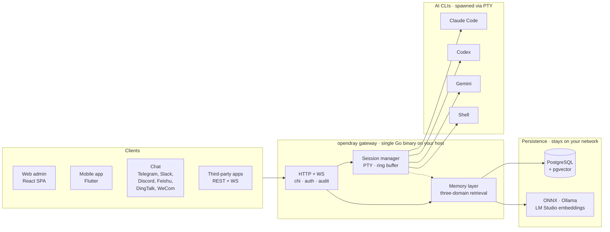

<p align="center">
  <a href="https://opendray.dev"></a>
</p>

<h1 align="center">opendray</h1>

<p align="center">
  <strong>Claude Code・Codex・Gemini・shell のためのセルフホスト型ゲートウェイ。それらすべてにまたがる、ローカルファーストな共通メモリレイヤーを備えています。</strong>
  <br/>
  <sub>セッションは自前のインフラ上で動作。web、モバイル、チャットから操作できます。連携用にオープンな REST + WebSocket API を提供。</sub>
</p>

<p align="center">
  <strong><a href="https://opendray.dev">🌐 opendray.dev</a></strong>
</p>

<p align="center">
  <a href="https://opendray.dev"></a>
  <a href="https://github.com/Opendray/opendray/releases/latest"></a>
  <a href="LICENSE"></a>
  <a href="https://github.com/Opendray/opendray/actions/workflows/ci.yml"></a>
  <a href="https://github.com/Opendray/opendray/discussions"></a>
  <br/>
  
  
  
  
</p>

<p align="center">
  🌐 <a href="README.md">English</a> · <a href="README.zh.md">简体中文</a> · <a href="README.fa.md">فارسی</a> · <a href="README.es.md">Español</a> · <a href="README.pt-BR.md">Português</a> · <strong>日本語</strong> · <a href="README.ko.md">한국어</a> · <a href="README.fr.md">Français</a> · <a href="README.de.md">Deutsch</a> · <a href="README.ru.md">Русский</a>
</p>

---

## opendray が存在する理由

AI コーディング CLI を日々使う中で生じる 3 つの摩擦を解消するために、opendray は作られました。

**ノート PC がスリープするとセッションが死んでしまう。** SSH 経由で Claude Code や Codex を動かしていると、蓋を閉じたり Wi-Fi が切れた瞬間にエージェントが落ちてしまいます。コンテキストも、実行中のツール呼び出しも、これからレビューしようとしていた差分も、すべて消えてしまいます。opendray はスリープしないホスト（机の下の Mac mini、NAS、VPS など）でエージェントを動かし、Web 管理画面、Flutter 製モバイルアプリ、あるいはチャットメッセージから再接続できるようにします。誰かが接続しているかどうかに関わらず、セッションは動き続けます。

**レート制限に当たったからといって、作業が台無しになるべきではない。** 複数の Anthropic アカウント（仕事用と個人用、ファミリープランと Pro など）を持っている場合、opendray はそれらをプールとして扱います。アカウントごとのティア、クォータ、アクティブなセッション数を可視化し、新しいセッションをアカウント間でバランスよく割り振り、会話を失うことなくライブセッションを別のアカウントに差し替えることができます。トランスクリプトもそのまま引き継がれます。Codex と Gemini のアカウントについても同様です。

**メモリは後付けではなく、第一級のレイヤーである。** ほとんどの AI CLI はセッションごとにプロジェクトコンテキストをゼロからインデックスし直し、繰り返しの検索でトークンを浪費しています。opendray はローカルファースト設計のベクトルストア（ONNX / Ollama / LM Studio のエンベディング）を標準搭載し、ユーザー、プロジェクト、セッションという 3 つのドメインにまたがる検索と、レイヤー間のドリフト検知を提供します。すべてのバイトはあなたのネットワーク内に留まります。

---

## opendray とは？

**opendray** は、あなたが普段使っている AI コーディング CLI（Claude Code、Codex、Gemini、そして任意の shell）をラップし、どこからでも操作できるものへと変えます。セッションは自宅サーバー / NAS / VPS 上で動作させ、アイドル状態になれば Telegram で通知を受け取り、スマートフォンから返信すれば次のプロンプトとしてそのまま流し込めます。すべては、エンドツーエンドで自分が管理するセルフホスト型ゲートウェイ上で完結します。

- 🛰 **1 つのバックエンド、3 つのサーフェス。** 単一の Go バイナリが React 製の web 管理画面と Flutter 製のモバイルアプリを配信し、すべての操作はサードパーティ連携用に REST + WebSocket API としても公開されます。
- 💬 **6 つの双方向チャネル、囲い込みなし。** Telegram、Slack、Discord、Feishu（飞书）、DingTalk（钉钉）、WeCom（企业微信）、さらに任意のカスタム連携用の Bridge アダプターを用意。どのチャネルから返信しても、正しいセッションへルーティングされます。
- 🧠 **ローカルファーストなメモリ。** ONNX / Ollama / LM Studio による埋め込み、3 スコープでの検索（user・project・session）、スマートランキング、レイヤー横断の競合検出。ベクターデータが自分のネットワークの外に出ることはありません。
- 🔌 **連携向けの API。** スコープ付きの API キー、呼び出しごとの audit log、リバースプロキシマウント。opendray を自社プロダクトの裏側のゲートウェイとして使うことも、単なる個人のコマンドセンターとして使うこともできます。
- 🔑 **複数 Claude アカウントによるフリート運用。** 複数の `claude login` アカウントをゲートウェイに登録すると、パネルがファイルシステムウォッチャーで自動検出し、新規セッションを有効なアカウント間で負荷分散します。さらに、動作中のセッションを別のアカウントへ **会話を失わずに** 切り替えることも可能です（裏側でトランスクリプトを移行します）。各アカウントの行には、現在のキャパシティ（subscription tier、rate-limit tier、アクティブセッション数、最終使用日時、現在の Anthropic メールアドレス）がライブで表示され、適切なものを一目で選べます。
- 🔒 **セルフホスト、ライセンスも明快。** Apache 2.0、単一の静的バイナリ、cosign 署名済みリリースと SPDX SBOM 付き。テレメトリ、クラウドアカウント、サブスクリプションは一切ありません。

## アーキテクチャ概観

1 つの Go バイナリがホスト上ですべてを動かします。クライアントは HTTP/WebSocket を通じてセッションを操作し、セッションマネージャーは各 AI CLI を独立した PTY で起動し、メモリレイヤーは共有ステートを Postgres に保存しつつ、ベクトル埋め込みは自前のプロバイダーから取得します。



図に出てくるものはすべて自前のネットワーク内で動作します。クラウド依存もなく、推論もネットワーク外には出ません。

---

## ステータス

**v2.7.0**（最新）。v2 世代は引き続き進化を続けています。major-as-generation（major = 製品世代であり、SemVer 厳密な意味での「破壊的変更」ではない）方針については
[`VERSIONING.md`](VERSIONING.md) を、リリース履歴の全体については
[`CHANGELOG.md`](CHANGELOG.md) を参照してください。

この世代で提供される主な内容:

- **ワンライナーのインストーラー / アンインストーラーウィザード**（Linux + macOS;
  Windows は WSL2 経由）。Postgres のブートストラップ、AI-CLI のインストール、
  管理者認証情報、待ち受けアドレス、バイナリのインストール、スキーママイグレーション、
  サービス登録まで、オペレーターを順を追って案内します。
- **自己管理型バイナリ。** `opendray update / start / stop /
  restart / status / providers list / providers update` により、
  日常運用で `systemctl` / `launchctl` に直接触れる必要はありません。
- **Goreleaser によるリリースパイプライン。** クロスコンパイル済みバイナリ
  （linux/darwin × amd64/arm64）、cosign による keyless 署名（Sigstore）、
  SPDX SBOM、アトミックに検証されるセルフアップデート。

## インストール

### ワンライナーインストーラー

**Linux / macOS / WSL2**

```sh
curl -fsSL https://raw.githubusercontent.com/Opendray/opendray/main/scripts/install.sh | bash
```

**Windows。** まず WSL2 をセットアップしてから、その中で Linux 用インストーラーを実行します。[詳細 →](scripts/README.md#windows)

```powershell
irm https://raw.githubusercontent.com/Opendray/opendray/main/scripts/install-windows.ps1 | iex
```

Postgres のセットアップ、AI-CLI のインストール、管理者認証情報、サービス登録まで案内し、約 5 から 10 分で動作するゲートウェイが手に入ります。ウィザードの動作内容、作成されるファイルレイアウト、オプション、トラブルシューティングについては [**`scripts/README.md`**](scripts/README.md) を参照してください。

> **手動の手順を確認したい方へ。** [**docs/getting-started.md**](docs/getting-started.md) をお読みください。ウィザードと同じ手順を 15 分で一通りなぞる、エンドツーエンドのガイドです。各ステップを自分の目で確認できます。

### npm / npx (Node ≥ 18)

グローバルインストールして `opendray` を `PATH` に追加:

```sh
npm install -g opendray
```

またはインストールせずにオンデマンドで実行:

```sh
npx opendray
```

**バイナリだけを** インストールします。ウィザードなし、サービス登録なし、Postgres セットアップなし。パッケージは対応するプラットフォームバイナリ (`opendray-{linux,darwin}-{x64,arm64}`) を `optionalDependencies` 経由で取り込みます（esbuild / Biome と同じパターン。`postinstall` なし、インストール時のネットワーク呼び出しなし）。スクリプト化された環境、エフェメラルランナー、または独自の Postgres とプロセススーパーバイザーをすでに運用している場合に便利です。

データベースを自分で用意してゲートウェイを起動します:

```sh
# 1. PostgreSQL 15+ と pgvector。DSN を向け、管理者パスワードを設定。
export OPENDRAY_DATABASE_URL="postgres://opendray:pw@127.0.0.1:5432/opendray?sslmode=disable"
export OPENDRAY_ADMIN_PASSWORD="$(openssl rand -base64 24)"
# 2. スキーマを適用してから実行（フォアグラウンド）。
opendray migrate
opendray serve        # → http://127.0.0.1:8770/admin/
```

pgvector のセットアップ、`config.toml`、systemd / launchd サービスとしての実行、更新方法など、完全なガイドは [**docs/install-binary.ja.md**](docs/install-binary.ja.md) を参照してください。

### アンインストール（Linux / macOS）

**デフォルト。** ゲートウェイを停止しバイナリを削除しますが、`config.toml`、データディレクトリ（bcrypt キーファイル、セッション、ノート、vault）、ログ、PostgreSQL データベースは **保持** します。再インストール時には中断したところから再開できます:

```sh
curl -fsSL https://raw.githubusercontent.com/Opendray/opendray/main/scripts/uninstall.sh | bash
```

**完全パージ。** さらに PG データベースと role を削除し、config / data / logs を消去、サービスユーザーも削除します。何か残っていれば声高に失敗する、削除後の検証ステップも含まれます:

```sh
curl -fsSL https://raw.githubusercontent.com/Opendray/opendray/main/scripts/uninstall.sh | OPENDRAY_PURGE=1 bash
```

### 日常運用コマンド

インストール後、`opendray` バイナリ自身がライフサイクルを管理するため、`systemctl` / `launchctl` の呪文を覚えておく必要はありません:

```sh
sudo opendray update --restart   # download latest release, verify SHA, atomic replace + restart
```

```sh
sudo opendray providers update   # bump installed AI CLIs (claude / codex / gemini) to npm-latest
```

```sh
opendray providers list          # see which AI CLIs are installed + their versions
```

```sh
sudo opendray start              # start | stop | restart | status; wraps systemd / launchd
```

サブコマンド一式は `opendray --help` で確認できます。

### デプロイ経路の選び方

サポートされているどの経路でも、セッションの起動、AI-CLI へのアクセス、暗号化バックアップ、連携 API 一式が利用できます。opendray はホスト常駐型のゲートウェイで、AI CLI を PTY 経由で起動し、プロセス状態（`~/.claude`、ssh-agent、プロジェクトファイル）をそれらと共有します。このモデルは本番運用での Docker が課すコンテナ隔離とは相容れないため、v2.x では Docker はサポート対象のデプロイ経路ではありません。

| 経路 | 適した用途 | 詳細 |
|---|---|---|
| 📦 **ビルド済みバイナリ** | 「とにかく動かしたい」。Linux / macOS、任意のスーパーバイザー | [リリースページ](https://github.com/Opendray/opendray/releases) → [本番環境へのデプロイ](#production-deploy) を参照 |
| 🐧 **systemd ユニット** | ベアメタル / VM / LXC の Linux マシン | [本番環境へのデプロイ §A](#option-a--systemd-bare-metal--vm--lxc) |
| 🍎 **macOS LaunchDaemon** | 自宅サーバーとして使う Mac mini / Mac Studio | [本番環境へのデプロイ §C](#option-c--macos-launchd-mac-mini--studio-as-home-server) |
| 🛠 **ソースからビルド** | 開発 / コントリビューション / カスタムビルド | 下記の [Quickstart](#quickstart-5-minute-dev-path) |

<a id="quickstart-5-minute-dev-path"></a>

## Quickstart（5 分で動かす開発用経路）

前提条件やトラブルシューティングを含む完全な手順は [`docs/quickstart.md`](docs/quickstart.md) を参照してください。凝縮した開発用経路は以下のとおりです:

```bash
# 1. Have a Postgres 15+ running on 127.0.0.1:5432 with pgvector enabled
#    (apt install postgresql-16 postgresql-16-pgvector / brew install postgresql@16 pgvector).
#    Point [database].url at any other DSN if you'd rather use a remote PG.

# 2. Local config. already gitignored.
cp config.example.toml config.toml
$EDITOR config.toml          # set [database].url, [admin].password

# 3. Build the web bundle into the embed tree.
cd app/web && pnpm install && pnpm build && cd ../..

# 4. Apply schema.
go run ./cmd/opendray migrate -config config.toml

# 5. Run.
go run ./cmd/opendray serve -config config.toml
# → REST + WS:  http://127.0.0.1:8770/api/v1/...
# → Web admin:  http://127.0.0.1:8770/admin/
```

これは OpenDray をフォアグラウンドで実行します。Ctrl-C で停止します。常駐デーモンとして動かしたい場合は、下記の **本番環境へのデプロイ** を参照してください。

<a id="production-deploy"></a>

## 本番環境へのデプロイ

サポートされているデプロイ経路は 4 つあります。自分の環境に合うものを選んでください。
いずれの経路でも、クラッシュ時の自動再起動、永続的な状態管理、
シークレットと設定の分離が得られます。

<a id="option-a--systemd-bare-metal--vm--lxc"></a>

### Option A: systemd（ベアメタル / VM / LXC）

Linux で推奨されるデプロイ経路です。
[`deploy/systemd/opendray.service`](deploy/systemd/opendray.service)
にハードニング済みのユニットを同梱しており、サンドボックス化（`ProtectSystem=strict`、`NoNewPrivileges`、
`MemoryDenyWriteExecute`、capability の剥奪）、`migrate` のあとに `serve` を起動する流れ、
20 秒のグレースフルストップウィンドウを備えています。

**まずはバイナリを入手してください。**
[リリースページ](https://github.com/Opendray/opendray/releases)
からビルド済みのアーカイブを取得する
（`opendray_*_linux_<arch>.tar.gz`。展開すると単一の `opendray` バイナリになります）か、
上記の [Quickstart](#quickstart-5-minute-dev-path)
の手順でソースからビルド（`go build ./cmd/opendray`）します。

```bash
# 1. Install the binary you just grabbed (or built).
sudo install -m 0755 /path/to/opendray /usr/local/bin/opendray

# 2. Create the service user + state dir.
sudo useradd -r -s /usr/sbin/nologin -d /var/lib/opendray opendray
sudo install -d -o opendray -g opendray -m 0700 /var/lib/opendray

# 3. Drop config + secrets (root-owned; mode 0640).
sudo install -D -m 0640 config.example.toml /etc/opendray/config.toml
sudo $EDITOR /etc/opendray/config.toml             # set [database].url etc.
sudo install -D -m 0640 -o root -g opendray /dev/null /etc/opendray/env.d/secrets
sudo $EDITOR /etc/opendray/env.d/secrets           # OPENDRAY_ADMIN_PASSWORD=…

# 4. Install + enable the unit.
sudo cp deploy/systemd/opendray.service /etc/systemd/system/
sudo systemctl daemon-reload
sudo systemctl enable --now opendray

# 5. Verify.
sudo systemctl status opendray
sudo journalctl -u opendray -f --no-pager
```

ユニットは `ExecStartPre` として `opendray migrate` を実行するため、初回起動時に
`serve` が始まる前にすべてのマイグレーションが適用されます。再起動ポリシーは
`on-failure`、5 秒のバックオフ、1 分あたり 5 回までのバースト制限です。

### Option B: 直接バイナリ + 任意のプロセススーパーバイザー

systemd のない LXC、FreeBSD `rc.d`、OpenRC、その他何でも構いません。
ビルドは一度だけ、起動は普段使いのスーパーバイザーで行えます:

```bash
# Cross-compile a release archive locally:
goreleaser release --clean --snapshot
ls dist/                  # opendray_*_linux_amd64.tar.gz etc.

# Or grab a published release artefact:
# https://github.com/Opendray/opendray/releases
```

そして、お好みのスーパーバイザー（s6、runit、supervisord、runwhen）に以下を指し示します:

```
/usr/local/bin/opendray serve -config /etc/opendray/config.toml
```

事前準備として、初回の `serve` の前に一度だけ
`opendray migrate -config /etc/opendray/config.toml` を実行するか、
お使いのスーパーバイザーの pre-start フックとして組み込んでください。

<a id="option-c--macos-launchd-mac-mini--studio-as-home-server"></a>

### Option C: macOS launchd（自宅サーバーとしての Mac mini / Studio）

24 時間 365 日稼働させる Apple Silicon の Mac mini / Mac Studio 向けです。
[`deploy/launchd/com.opendray.opendray.plist`](deploy/launchd/com.opendray.opendray.plist)
に LaunchDaemon を同梱しており、ユーザーログインの前のブート時に起動、
クラッシュ時は 5 秒のスロットルで再起動、ログは `/usr/local/var/log/opendray/` に出力されます。

```bash
# 1. Install the darwin binary + config + state dirs.
sudo install -m 0755 ./opendray /usr/local/bin/opendray
sudo install -d -m 0755 \
  /usr/local/etc/opendray \
  /usr/local/var/lib/opendray \
  /usr/local/var/log/opendray
sudo install -m 0640 config.example.toml /usr/local/etc/opendray/config.toml
sudo $EDITOR /usr/local/etc/opendray/config.toml    # set [database].url etc.

# 2. Apply migrations once.
sudo /usr/local/bin/opendray migrate \
  -config /usr/local/etc/opendray/config.toml

# 3. Install + load the LaunchDaemon.
sudo cp deploy/launchd/com.opendray.opendray.plist /Library/LaunchDaemons/
sudo chown root:wheel /Library/LaunchDaemons/com.opendray.opendray.plist
sudo chmod 0644 /Library/LaunchDaemons/com.opendray.opendray.plist
sudo launchctl bootstrap system /Library/LaunchDaemons/com.opendray.opendray.plist

# 4. Verify.
sudo launchctl print system/com.opendray.opendray
tail -f /usr/local/var/log/opendray/opendray.log
```

再起動は `sudo launchctl kickstart -k system/com.opendray.opendray`、
完全にアンロードするには `sudo launchctl bootout system/com.opendray.opendray` を実行します。

macOS での Postgres。Homebrew でインストールし（`brew install postgresql@17 && brew services start postgresql@17`）、`[database].url` を
`postgres://$USER@127.0.0.1:5432/opendray` に向けます。`pgvector` は
`brew install pgvector` で導入し、opendray データベース内で
`CREATE EXTENSION vector` を実行してください。

---

Proxmox 固有の LXC に関するメモ（非特権コンテナでの PTY、ネットワーク、
cgroup の調整）については、[`deploy/lxc/proxmox-pty-notes.md`](deploy/lxc/proxmox-pty-notes.md) を参照してください。

リバースプロキシ / TLS 終端（nginx、Caddy、Traefik、Cloudflare
Tunnel）については、[`docs/operator-guide.md`](docs/operator-guide.md) の §Topology を参照してください。

### オプション: 暗号化 DB バックアップとデータエクスポートを有効にする

```bash
# Master passphrase (env-only; never write into config.toml).
export OPENDRAY_BACKUP_KEY="$(openssl rand -base64 32)"
export OPENDRAY_BACKUP_ENABLED=1

# pg_dump / pg_restore must match the server's major version. On
# Apple Silicon dev machines pointing at a PG17 server:
export OPENDRAY_BACKUP_PG_DUMP_PATH=/opt/homebrew/opt/postgresql@17/bin/pg_dump
export OPENDRAY_BACKUP_PG_RESTORE_PATH=/opt/homebrew/opt/postgresql@17/bin/pg_restore
```

opendray を再起動すると、サイドバーに Backups ページ（`/backups`）が現れ、
暗号化された PostgreSQL ダンプとリストアを行えます。`/export` では
zip バンドルでのデータエクスポート / インポートが可能です。ライフサイクル全体については [`docs/operator-guide.md`](docs/operator-guide.md) の §Backup を参照してください。

単一の Go バイナリが web バンドルを丸ごと内包しているため、ランタイムに Node は
不要で、静的ファイル用の別サーバーも、Caddy / nginx も必要ありません。
TLS 終端は `:8770` の手前で Cloudflare Tunnel に任せられます。

## レイアウト

```
cmd/opendray/        binary entry point (≤100 LOC per design §14)
internal/
├── app/             composition root (wires every subsystem)
├── audit/           subscribes to bus topics, persists to audit_log
├── auth/            admin bearer tokens (M2.5)
├── backup/          encrypted DB dumps + admin export/import
├── catalog/         CLI provider manifests + per-id user config (M2)
├── channel/         channel hub + telegram impl (M4)
├── config/          TOML loader with OPENDRAY_* env overrides
├── eventbus/        in-process pub/sub
├── gateway/         chi HTTP router + middleware + slog
├── integration/     external-app registry + reverse proxy + events WS (M3)
├── memory/          cross-CLI persistent memory
├── session/         PTY lifecycle + ring buffer + WS stream (M1)
├── store/           pgx pool + hand-rolled migration runner (M0)
├── version/         build-time identification
└── web/             go:embed of the web bundle (W5)

app/web/             React 19 + TypeScript + Vite SPA (Phase 2 W0-W5)
app/mobile/          Flutter app (iOS + Android), feature parity with web
docs/
├── design.md        SSOT north-star
└── adr/             architecture decisions, dated
```

## Web フロントエンド

`app/web/` は単一の SPA を `internal/web/dist/` にビルドし、Go バイナリが
それを埋め込んで `/admin/*` で配信します。Vite の開発サーバー（`:5173`）は
`/api` を `:8770` にプロキシし、HMR を効かせた開発が行えます。

```bash
# dev (hot reload on the React side, separate Go server for the API)
cd app/web && pnpm dev               # http://localhost:5173
go run ./cmd/opendray serve -config ../../config.toml   # other terminal

# prod (one binary delivers everything)
cd app/web && pnpm build              # writes ../../internal/web/dist
cd ../..
go build ./cmd/opendray               # bakes dist into the binary
./opendray serve -config config.toml
```

フロントエンドのスタック（React + Vite + Tailwind v4 + shadcn/ui + TanStack Router/Query +
Zustand + xterm.js）や、W マイルストーンごとのノートについては
[`app/web/README.md`](app/web/README.md) を参照してください。

## ドキュメント

- [`docs/getting-started.md`](docs/getting-started.md): はじめての方は **まずここから**。ラップ対象の CLI のインストールや Postgres のブートストラップも含めて、ゼロから最初のセッションまでを 15 分で
- [`docs/install-binary.ja.md`](docs/install-binary.ja.md): npm パッケージまたはリリースバイナリからインストールし（Postgres は自分で用意）、systemd / launchd サービスとして実行する
- [`docs/quickstart.md`](docs/quickstart.md): 5 分で動かす開発環境（構成要素は既に把握している前提）
- [`docs/mobile-app.ja.md`](docs/mobile-app.ja.md): Flutter モバイルアプリのビルドとインストール — Android APK をサイドロードするか Xcode で iPhone に入れ、ゲートウェイに向ける
- [`docs/operator-guide.md`](docs/operator-guide.md): 本番寄りの構成向けのデプロイ + 運用リファレンス
- [`docs/integration-guide.md`](docs/integration-guide.md): 任意の言語で外部連携を書くためのガイド
- [`VERSIONING.md`](VERSIONING.md): バージョニング戦略（major-as-generation）
- [`CHANGELOG.md`](CHANGELOG.md): リリース履歴

## テスト

```bash
go test -race ./...        # backend
cd app/web && pnpm build   # web (TS strict + vite production build)
```

エンドツーエンドのスモークフローは、マイルストーンごとのコミットメッセージで管理しています。
Playwright によるハーネスは今後の対応として予定されています。

## v1 との関係

v1（`Opendray/opendray`）は既にアーカイブされたレガシーコードベースです。v2 は
現行かつアクティブな世代で、feature-complete であり、開発が継続しているのは
このブランチだけです。v1 の 16 個のビルトインのうち、4 つが v2 のバックエンドへ
移行し、残りはクライアント側の機能、チャネルアダプター、あるいは連携 API の
利用側へと姿を変えています。

## ライセンス

Apache 2.0。詳細は [`LICENSE`](LICENSE) を参照してください。（v1 は MIT でしたが、
v2 は独立してライセンスされています。）
