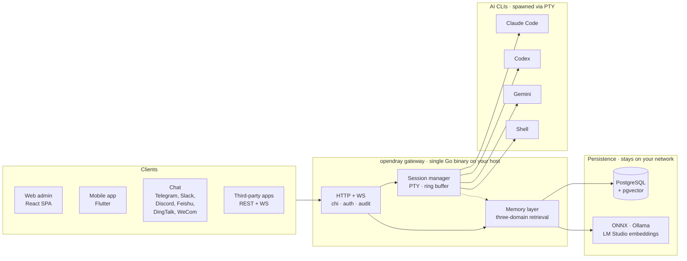

<p align="center">
  <a href="https://opendray.dev"></a>
</p>

<h1 align="center">opendray</h1>

<p align="center">
  <strong>Gateway self-hosted para Claude Code · Codex · Gemini · shell, com uma camada de memória local-first compartilhada entre todos eles.</strong>
  <br/>
  <sub>Rode sessões na sua própria infra. Controle pelo navegador, celular ou chat. API aberta REST + WebSocket para integrações.</sub>
</p>

<p align="center">
  <strong><a href="https://opendray.dev">🌐 opendray.dev</a></strong>
</p>

<p align="center">
  <a href="https://opendray.dev"></a>
  <a href="https://github.com/Opendray/opendray/releases/latest"></a>
  <a href="LICENSE"></a>
  <a href="https://github.com/Opendray/opendray/actions/workflows/ci.yml"></a>
  <a href="https://github.com/Opendray/opendray/discussions"></a>
  <br/>
  
  
  
  
</p>

<p align="center">
  🌐 <a href="README.md">English</a> · <a href="README.zh.md">简体中文</a> · <a href="README.fa.md">فارسی</a> · <a href="README.es.md">Español</a> · <strong>Português</strong> · <a href="README.ja.md">日本語</a> · <a href="README.ko.md">한국어</a> · <a href="README.fr.md">Français</a> · <a href="README.de.md">Deutsch</a> · <a href="README.ru.md">Русский</a>
</p>

---

## Por que o opendray existe

Três incômodos do dia a dia com CLIs de IA para programação que o opendray foi feito para resolver.

**Sessões morrem quando seu notebook dorme.** Rodar o Claude Code ou o Codex via SSH significa que o agente morre no instante em que você fecha a tampa da máquina ou o Wi-Fi cai. Contexto, chamadas de ferramentas no meio do caminho, aquele diff parcial que você ia revisar. Tudo perdido. O opendray roda o agente em um host que não dorme (um Mac mini debaixo da sua mesa, um NAS, um VPS) e te deixa reconectar pelo admin web, por um app mobile em Flutter ou por uma mensagem de chat. A sessão segue executando, esteja alguém conectado ou não.

**Bater no rate limit não deveria matar o que você estava fazendo.** Se você tem várias contas Anthropic (trabalho + pessoal, plano família + Pro), o opendray trata elas como um pool: mostra tier, cota e número de sessões ativas por conta, distribui novas sessões entre elas e deixa você trocar uma sessão em andamento para outra conta sem perder o fio da conversa. O transcript vai junto. Mesma coisa para contas Codex e Gemini.

**Memória é uma camada de primeira classe, não algo enfiado depois.** A maioria das CLIs de IA reindexa o contexto do projeto do zero a cada sessão, queimando tokens em recuperação repetida. O opendray vem com um vector store local-first (embeddings via ONNX / Ollama / LM Studio) com recuperação em três domínios (usuário, projeto, sessão) mais detecção de drift entre as camadas. Cada byte fica na sua rede.

---

## O que é o opendray?

O **opendray** encapsula as CLIs de coding com IA que você já usa (Claude Code, Codex, Gemini, mais qualquer shell) e transforma elas em algo que dá pra controlar de qualquer lugar. Rode sessões no seu servidor de casa / NAS / VPS, receba uma notificação no Telegram quando uma delas ficar ociosa, responda do celular pra mandar o próximo prompt. Tudo isso através de um gateway self-hosted que você controla de ponta a ponta.

- 🛰 **Um backend, três superfícies.** Um único binário Go que serve um painel web em React e um app mobile em Flutter, com toda ação também exposta numa API REST + WebSocket pra integrações de terceiros.
- 💬 **Seis canais bidirecionais, sem jardim murado.** Telegram, Slack, Discord, Feishu (飞书), DingTalk (钉钉), WeCom (企业微信), mais um adaptador Bridge pra qualquer coisa custom. Respostas em qualquer canal são roteadas de volta pra sessão certa.
- 🧠 **Memória local-first.** Embeddings via ONNX / Ollama / LM Studio, retrieval em três escopos (usuário · projeto · sessão), ranking inteligente e detecção de conflito entre camadas. Nenhum dado vetorial sai da sua rede.
- 🔌 **API de nível integração.** API keys com scope, audit log por chamada, mounts de reverse-proxy. Trate o opendray como o gateway por trás do seu próprio produto, ou só como uma central de comando pessoal.
- 🔑 **Frota multi-conta do Claude.** Coloque várias contas de `claude login` no gateway; o painel descobre elas automaticamente via filesystem watcher, balanceia as novas sessões entre as contas habilitadas, e te deixa trocar a conta de uma sessão em execução **sem perder a conversa** (o transcript é migrado por baixo dos panos). Cada linha de conta mostra a capacidade em tempo real (subscription tier, rate-limit tier, sessões ativas, último uso, email do Anthropic atual) pra você escolher a certa de bate-pronto.
- 🔒 **Self-hosted, licença clara.** Apache 2.0, um único binário estático, releases assinadas com cosign e SBOM SPDX. Sem telemetria, sem conta na nuvem, sem assinatura.

## Arquitetura em um relance

Um único binário Go no seu host toca a orquestra. Os clients manejam as sessões via HTTP/WebSocket, o session manager lança cada AI CLI no seu próprio PTY, e a camada de memory guarda o estado compartilhado no Postgres com vector embeddings do seu próprio provider.



Tudo o que está no diagrama roda na sua rede. Sem dependências de cloud, sem inference fora do seu controle.

---

## Status

**v2.7.0** (último). A geração v2 segue iterando. Veja
[`VERSIONING.md`](VERSIONING.md) pra política major-como-geração
(major = geração de produto, não "breaking change" estrito ao estilo SemVer) e
[`CHANGELOG.md`](CHANGELOG.md) pro histórico completo de releases.

Esta geração entrega:

- **Wizards de instalação e desinstalação em uma linha** (Linux + macOS;
  Windows passa por WSL2). Guiam o operador pelo bootstrap do Postgres,
  instalação das AI-CLIs, credenciais de admin, endereço de escuta,
  instalação do binário, migração do schema e registro do serviço.
- **Binário autogerenciável.** `opendray update / start / stop /
  restart / status / providers list / providers update`, pra que os operadores
  não precisem encostar em `systemctl` / `launchctl` no dia a dia.
- **Pipeline de release com Goreleaser.** Binários cross-compilados
  (linux/darwin × amd64/arm64), assinatura keyless com cosign (Sigstore),
  SBOM SPDX, self-update verificado atomicamente.

## Instalação

### Instalador de uma linha

**Linux / macOS / WSL2**

```sh
curl -fsSL https://raw.githubusercontent.com/Opendray/opendray/main/scripts/install.sh | bash
```

**Windows**: configura o WSL2 primeiro e depois roda o instalador do Linux por dentro. [detalhes →](scripts/README.md#windows)

```powershell
irm https://raw.githubusercontent.com/Opendray/opendray/main/scripts/install-windows.ps1 | iex
```

Passa pela configuração do Postgres, instalação das AI-CLIs, credenciais de admin e registro do serviço, deixando o gateway rodando em ~5 a 10 minutos. Veja [**`scripts/README.md`**](scripts/README.md) pra entender o que o wizard faz, o layout de arquivos que ele cria, as opções e troubleshooting.

> **Prefere fazer o passo a passo manual?** Leia [**docs/getting-started.md**](docs/getting-started.md), um guia de 15 minutos de ponta a ponta que espelha o que o wizard faz, pra você conferir cada etapa por conta própria.

### npm / npx (Node ≥ 18)

Instala globalmente e coloca `opendray` no `PATH`:

```sh
npm install -g opendray
```

Ou roda sob demanda sem instalar:

```sh
npx opendray
```

Instala **só o binário**: sem wizard, sem serviço, sem Postgres. O pacote traz o binário de plataforma correspondente (`opendray-{linux,darwin}-{x64,arm64}`) via `optionalDependencies` (o padrão do esbuild / Biome, sem `postinstall`, sem chamada de rede durante a instalação). Bom para ambientes com scripts, runners efêmeros, ou quando você já roda seu próprio Postgres e supervisor de processos.

Você ainda traz um banco e sobe o gateway por conta própria:

```sh
# 1. PostgreSQL 15+ com pgvector. Aponte um DSN para ele, defina uma senha de admin.
export OPENDRAY_DATABASE_URL="postgres://opendray:pw@127.0.0.1:5432/opendray?sslmode=disable"
export OPENDRAY_ADMIN_PASSWORD="$(openssl rand -base64 24)"
# 2. Aplique o schema, depois rode (foreground).
opendray migrate
opendray serve        # → http://127.0.0.1:8770/admin/
```

Passo a passo completo (setup do pgvector, `config.toml`, rodar como serviço systemd / launchd e atualizar) em [**docs/install-binary.pt-BR.md**](docs/install-binary.pt-BR.md).

### Desinstalação (Linux / macOS)

**Padrão.** Para o gateway e remove o binário, mas **mantém** seu `config.toml`, o diretório de dados (keyfile bcrypt, sessões, notas, vault), os logs e o banco PostgreSQL pra que uma reinstalação retome de onde você parou:

```sh
curl -fsSL https://raw.githubusercontent.com/Opendray/opendray/main/scripts/uninstall.sh | bash
```

**Purge completo.** Também dropa o banco PG + a role, apaga config / data / logs e remove o service user. Inclui um passo de verificação pós-remoção que falha barulhento se algo sobreviver:

```sh
curl -fsSL https://raw.githubusercontent.com/Opendray/opendray/main/scripts/uninstall.sh | OPENDRAY_PURGE=1 bash
```

### Comandos do dia a dia

Depois da instalação, o binário `opendray` cuida do próprio ciclo de vida, sem precisar decorar os encantamentos de `systemctl` / `launchctl`:

```sh
sudo opendray update --restart   # download latest release, verify SHA, atomic replace + restart
```

```sh
sudo opendray providers update   # bump installed AI CLIs (claude / codex / gemini) to npm-latest
```

```sh
opendray providers list          # see which AI CLIs are installed + their versions
```

```sh
sudo opendray start              # start | stop | restart | status, wraps systemd / launchd
```

`opendray --help` lista o conjunto completo de subcomandos.

### Escolha do caminho de deploy

Todo caminho suportado inclui spawn de sessões, acesso às AI-CLIs, backups criptografados e a API de integração completa. O opendray é um gateway host-resident: ele spawna as AI CLIs via PTYs e compartilha estado de processo (`~/.claude`, ssh-agent, arquivos do projeto) com elas. Esse modelo é incompatível com o isolamento de container que o Docker de produção imporia, então o Docker não é um caminho de deploy suportado na v2.x.

| Caminho | Recomendado pra | Ir pra |
|---|---|---|
| 📦 **Binário pré-buildado** | "Só rodar" (Linux / macOS, qualquer supervisor) | [Página de releases](https://github.com/Opendray/opendray/releases) → veja [Deploy de produção](#production-deploy) |
| 🐧 **Unit systemd** | Linux bare-metal / VM / LXC | [Deploy de produção §A](#option-a--systemd-bare-metal--vm--lxc) |
| 🍎 **LaunchDaemon do macOS** | Mac mini / Mac Studio como servidor doméstico | [Deploy de produção §C](#option-c--macos-launchd-mac-mini--studio-as-home-server) |
| 🛠 **Build a partir do código-fonte** | Desenvolvimento / contribuição / builds custom | [Quickstart](#quickstart-5-minute-dev-path) abaixo |

<a id="quickstart-5-minute-dev-path"></a>

## Quickstart (caminho dev de 5 minutos)

Pra um passo a passo completo com pré-requisitos e troubleshooting, veja [`docs/quickstart.md`](docs/quickstart.md). A versão condensada do caminho de dev:

```bash
# 1. Have a Postgres 15+ running on 127.0.0.1:5432 with pgvector enabled
#    (apt install postgresql-16 postgresql-16-pgvector / brew install postgresql@16 pgvector).
#    Point [database].url at any other DSN if you'd rather use a remote PG.

# 2. Local config (already gitignored).
cp config.example.toml config.toml
$EDITOR config.toml          # set [database].url, [admin].password

# 3. Build the web bundle into the embed tree.
cd app/web && pnpm install && pnpm build && cd ../..

# 4. Apply schema.
go run ./cmd/opendray migrate -config config.toml

# 5. Run.
go run ./cmd/opendray serve -config config.toml
# → REST + WS:  http://127.0.0.1:8770/api/v1/...
# → Web admin:  http://127.0.0.1:8770/admin/
```

Isso roda o OpenDray em foreground (Ctrl-C derruba). Pra um daemon de longa duração, veja **Deploy de produção** abaixo.

<a id="production-deploy"></a>

## Deploy de produção

Quatro caminhos de deploy suportados; escolha o que casar com o seu ambiente.
Cada um te dá auto-restart em caso de crash, estado persistente e
separação dos segredos em relação ao config.

<a id="option-a--systemd-bare-metal--vm--lxc"></a>

### Opção A. systemd (bare-metal / VM / LXC)

O caminho de deploy recomendado no Linux. Vem com uma unit endurecida em
[`deploy/systemd/opendray.service`](deploy/systemd/opendray.service)
com sandboxing (`ProtectSystem=strict`, `NoNewPrivileges`,
`MemoryDenyWriteExecute`, capability scrub), boot no esquema
`migrate`-depois-`serve`, e uma janela de graceful-stop de 20s.

**Pegue um binário primeiro.** Ou baixe um arquivo pré-buildado da
[página de releases](https://github.com/Opendray/opendray/releases)
(`opendray_*_linux_<arch>.tar.gz`, que descompacta num único binário `opendray`),
ou builde do código-fonte pelo [Quickstart](#quickstart-5-minute-dev-path)
acima (`go build ./cmd/opendray`).

```bash
# 1. Install the binary you just grabbed (or built).
sudo install -m 0755 /path/to/opendray /usr/local/bin/opendray

# 2. Create the service user + state dir.
sudo useradd -r -s /usr/sbin/nologin -d /var/lib/opendray opendray
sudo install -d -o opendray -g opendray -m 0700 /var/lib/opendray

# 3. Drop config + secrets (root-owned; mode 0640).
sudo install -D -m 0640 config.example.toml /etc/opendray/config.toml
sudo $EDITOR /etc/opendray/config.toml             # set [database].url etc.
sudo install -D -m 0640 -o root -g opendray /dev/null /etc/opendray/env.d/secrets
sudo $EDITOR /etc/opendray/env.d/secrets           # OPENDRAY_ADMIN_PASSWORD=…

# 4. Install + enable the unit.
sudo cp deploy/systemd/opendray.service /etc/systemd/system/
sudo systemctl daemon-reload
sudo systemctl enable --now opendray

# 5. Verify.
sudo systemctl status opendray
sudo journalctl -u opendray -f --no-pager
```

A unit roda `opendray migrate` como `ExecStartPre`, então o primeiro boot
aplica todas as migrations antes de o `serve` subir. Os restarts são
`on-failure` com back-off de 5s e limite de 5 rajadas por minuto.

### Opção B. Binário direto + seu próprio supervisor de processos

Pra LXC sem systemd, FreeBSD `rc.d`, OpenRC, ou qualquer outra coisa.
Builde uma vez, rode com o supervisor que você já usa:

```bash
# Cross-compile a release archive locally:
goreleaser release --clean --snapshot
ls dist/                  # opendray_*_linux_amd64.tar.gz etc.

# Or grab a published release artefact:
# https://github.com/Opendray/opendray/releases
```

Depois aponta seu supervisor (s6, runit, supervisord, runwhen) pra:

```
/usr/local/bin/opendray serve -config /etc/opendray/config.toml
```

Pré-flight: rode `opendray migrate -config /etc/opendray/config.toml`
uma vez antes do primeiro `serve`, ou como hook de pre-start no supervisor
que você preferir.

<a id="option-c--macos-launchd-mac-mini--studio-as-home-server"></a>

### Opção C. launchd no macOS (Mac mini / Studio como servidor doméstico)

Pra Mac mini / Mac Studio com Apple Silicon rodando 24/7. Vem com um
LaunchDaemon em
[`deploy/launchd/com.opendray.opendray.plist`](deploy/launchd/com.opendray.opendray.plist)
que sobe no boot antes de qualquer login de usuário, reinicia em caso de crash com
throttle de 5s, e loga em `/usr/local/var/log/opendray/`.

```bash
# 1. Install the darwin binary + config + state dirs.
sudo install -m 0755 ./opendray /usr/local/bin/opendray
sudo install -d -m 0755 \
  /usr/local/etc/opendray \
  /usr/local/var/lib/opendray \
  /usr/local/var/log/opendray
sudo install -m 0640 config.example.toml /usr/local/etc/opendray/config.toml
sudo $EDITOR /usr/local/etc/opendray/config.toml    # set [database].url etc.

# 2. Apply migrations once.
sudo /usr/local/bin/opendray migrate \
  -config /usr/local/etc/opendray/config.toml

# 3. Install + load the LaunchDaemon.
sudo cp deploy/launchd/com.opendray.opendray.plist /Library/LaunchDaemons/
sudo chown root:wheel /Library/LaunchDaemons/com.opendray.opendray.plist
sudo chmod 0644 /Library/LaunchDaemons/com.opendray.opendray.plist
sudo launchctl bootstrap system /Library/LaunchDaemons/com.opendray.opendray.plist

# 4. Verify.
sudo launchctl print system/com.opendray.opendray
tail -f /usr/local/var/log/opendray/opendray.log
```

Reinicie com `sudo launchctl kickstart -k system/com.opendray.opendray`;
desmonte por completo com `sudo launchctl bootout system/com.opendray.opendray`.

Postgres no macOS: instale via Homebrew (`brew install postgresql@17 && brew services start postgresql@17`) e aponte `[database].url` pra
`postgres://$USER@127.0.0.1:5432/opendray`. Adicione o `pgvector` com
`brew install pgvector` e rode `CREATE EXTENSION vector` dentro do banco
do opendray.

---

Pra notas específicas de LXC no Proxmox (PTY em containers unprivileged,
networking, ajustes de cgroup), veja [`deploy/lxc/proxmox-pty-notes.md`](deploy/lxc/proxmox-pty-notes.md).

Pra reverse-proxy / terminação TLS (nginx, Caddy, Traefik, Cloudflare
Tunnel), veja [`docs/operator-guide.md`](docs/operator-guide.md) §Topology.

### Opcional: habilitar backups criptografados do DB + exports de dados

```bash
# Master passphrase (env-only, never write into config.toml).
export OPENDRAY_BACKUP_KEY="$(openssl rand -base64 32)"
export OPENDRAY_BACKUP_ENABLED=1

# pg_dump / pg_restore must match the server's major version. On
# Apple Silicon dev machines pointing at a PG17 server:
export OPENDRAY_BACKUP_PG_DUMP_PATH=/opt/homebrew/opt/postgresql@17/bin/pg_dump
export OPENDRAY_BACKUP_PG_RESTORE_PATH=/opt/homebrew/opt/postgresql@17/bin/pg_restore
```

Reinicie o opendray; o sidebar ganha uma página de Backups (`/backups`)
pra dumps criptografados do PostgreSQL + restore, e `/export` pra
exports de dados em bundle zip + import. Veja [`docs/operator-guide.md`](docs/operator-guide.md) §Backup pro ciclo completo.

Um único binário Go carrega o bundle web inteiro: sem runtime de Node em
runtime, sem servidor de arquivos estáticos separado, sem Caddy/nginx
necessários. O Cloudflare Tunnel termina TLS na frente do `:8770`.

## Layout

```
cmd/opendray/        binary entry point (≤100 LOC per design §14)
internal/
├── app/             composition root (wires every subsystem)
├── audit/           subscribes to bus topics, persists to audit_log
├── auth/            admin bearer tokens (M2.5)
├── backup/          encrypted DB dumps + admin export/import
├── catalog/         CLI provider manifests + per-id user config (M2)
├── channel/         channel hub + telegram impl (M4)
├── config/          TOML loader with OPENDRAY_* env overrides
├── eventbus/        in-process pub/sub
├── gateway/         chi HTTP router + middleware + slog
├── integration/     external-app registry + reverse proxy + events WS (M3)
├── memory/          cross-CLI persistent memory
├── session/         PTY lifecycle + ring buffer + WS stream (M1)
├── store/           pgx pool + hand-rolled migration runner (M0)
├── version/         build-time identification
└── web/             go:embed of the web bundle (W5)

app/web/             React 19 + TypeScript + Vite SPA (Phase 2 W0-W5)
app/mobile/          Flutter app (iOS + Android), feature parity with web
docs/
├── design.md        SSOT north-star
└── adr/             architecture decisions, dated
```

## Frontend web

O `app/web/` builda uma SPA única em `internal/web/dist/`, que o binário Go
embeda e serve em `/admin/*`. O dev server do Vite em `:5173` faz proxy de
`/api` pra `:8770` pra desenvolvimento com HMR.

```bash
# dev (hot reload on the React side, separate Go server for the API)
cd app/web && pnpm dev               # http://localhost:5173
go run ./cmd/opendray serve -config ../../config.toml   # other terminal

# prod (one binary delivers everything)
cd app/web && pnpm build              # writes ../../internal/web/dist
cd ../..
go build ./cmd/opendray               # bakes dist into the binary
./opendray serve -config config.toml
```

Veja [`app/web/README.md`](app/web/README.md) pro stack do frontend
(React + Vite + Tailwind v4 + shadcn/ui + TanStack Router/Query +
Zustand + xterm.js) e notas por milestone W.

## Documentação

- [`docs/getting-started.md`](docs/getting-started.md): **comece por aqui** se você é novo. Do zero até a primeira sessão em 15 minutos, incluindo a instalação das CLIs encapsuladas e o bootstrap do Postgres
- [`docs/install-binary.pt-BR.md`](docs/install-binary.pt-BR.md): instale pelo pacote npm ou um binário de release (traga seu próprio Postgres) e rode como serviço systemd / launchd
- [`docs/quickstart.md`](docs/quickstart.md): ambiente de dev em 5 minutos (assume que você já conhece as peças)
- [`docs/mobile-app.pt-BR.md`](docs/mobile-app.pt-BR.md): compile e instale o app móvel Flutter — faça sideload de um APK Android ou instale no iPhone via Xcode e aponte para o seu gateway
- [`docs/operator-guide.md`](docs/operator-guide.md): referência de deploy + ops pra setups mais próximos de produção
- [`docs/integration-guide.md`](docs/integration-guide.md): como escrever uma integração externa em qualquer linguagem
- [`VERSIONING.md`](VERSIONING.md): estratégia de versionamento (major-as-generation)
- [`CHANGELOG.md`](CHANGELOG.md): histórico de releases

## Tests

```bash
go test -race ./...        # backend
cd app/web && pnpm build   # web (TS strict + vite production build)
```

Os smoke flows end-to-end são acompanhados nos commit messages por milestone.
Um harness Playwright está planejado como follow-up.

## Relação com a v1

A v1 (`Opendray/opendray`) é o codebase legado, agora arquivado. A v2 é
a geração atual e ativa, feature-complete e o único branch recebendo
desenvolvimento. Dos 16 builtins da v1, quatro migraram pro backend da
v2; o resto virou feature client-side, adaptador de canal ou consumidor
da API de integração.

## Licença

Apache 2.0. Veja [`LICENSE`](LICENSE). (A v1 era MIT; a v2 é licenciada
de forma independente.)
